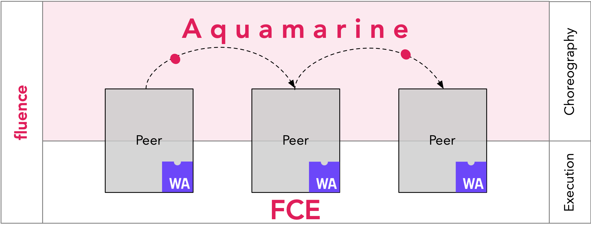

# Fluence Project

**Fluence is a peer-to-peer computing protocol and a software licensing system.** 

*The project is a work in progress!* 

See the [Motivation](http://fluence.network/manifesto.html), follow updates on [Twitter](https://twitter.com/fluence_project) or subscribe to the [newsletter](https://fluence.network/).

# Fluence stack


|         Layer         |                                                               Tech                                                               |              Scale              |               State               |                          Based on                          |
| :-------------------: | :------------------------------------------------------------------------------------------------------------------------------: | :-----------------------------: | :-------------------------------: | :--------------------------------------------------------: |
|       Execution       |                                            [FCE](https://github.com/fluencelabs/fce)                                             |           Single peer           | Disk, network, external processes | Wasm, [IT](https://github.com/fluencelabs/interface-types), [Wasmer*](https://github.com/fluencelabs/wasmer) |
|      Composition      |                                     [Aquamarine](https://github.com/fluencelabs/aquamarine)                                      |         Involved peers          |      Results and signatures       |                       ⇅, π-calculus                        |
|       Topology        | [TrustGraph](https://github.com/fluencelabs/fluence/tree/master/trust-graph), [DHT*](https://github.com/fluencelabs/rust-libp2p) | Distributed with Kademlia* algo |    Actual state of the network    |      [libp2p](https://github.com/libp2p/rust-libp2p)       |
| Security & Accounting |                                                            Blockchain                                                            |          Whole network          |        Licenses & payments        |                         substrate?                         |

<br/>

<p width="100%">

</p>

## Quick summary

Fluence protocol aims to empower internet applications with interoperability, resilience, and security. Fluence makes it possible to publish, run, compose, and monetize applications without intermediaries or central servers.

- **Fluence** is an open runtime for internet applications. A purely peer-to-peer architecture allows to build distributed applications without reliance on centralized platforms. Fluence incorporates concepts of Web of Trust, DPKI, S/Kademlia, and is built with libp2p and WebAssembly.
- **Fluence** is a business model for the open source. Fluence enables the blockchain-based software licensing system, allowing authors to earn income from their applications usage over the protocol. The infrastructure maintenance is outsourced to the open market of compute providers via the Open Source as a Service (OSaaS) model.


## Run
### Prebuilt docker image
```bash
docker run -d --name fluence -v $PWD:/.fluence -e RUST_LOG="info" -p 7777 -p 9999 fluencelabs/fluence
```
Ports will be assigned randomly by your OS.

### Build from sources
Install cargo, clone this repo, and then run:
```bash
make build

./target/release/fluence -t 7777 -w 9999
```
This will run fluence with a randomly generated key, listening for `ws://` on `9999`, and for tcp on `7777`.

## **Contributing**

While the project is a still in the early stage of development, you are welcome to track progress and contribute. At the current moment we don't have detailed instructions on how to join development or which code guidelines to follow. However, you can expect more info to appear soon enough. In the meanwhile, check out the [basic contributing rules](https://github.com/fluencelabs/fluence/blob/trustless_computing/CONTRIBUTING.md).

## **License**

[Apache 2.0](https://github.com/fluencelabs/fluence/blob/trustless_computing/LICENSE.md)
