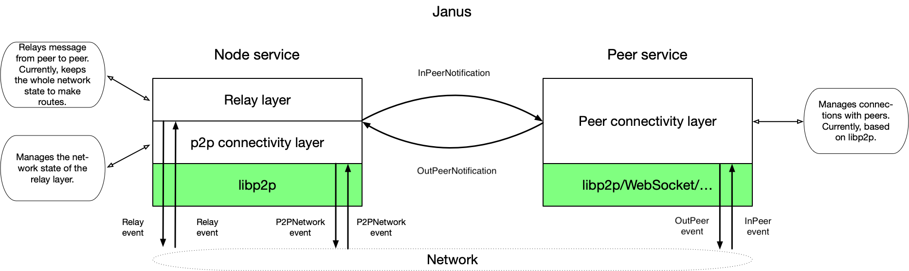

# fluence
Pluggable relay infrastructure for p2p-enabled applications.

## How to build

```bash
make
```

## How to run

Run server:
```bash
make server
```

Run server with debug logs:
```bash
make server-debug
``` 

Run client:
```bash
make client
```

Run client with debug logs:
```bash
make client-debug args="multiaddr peer_id"
```

## Architecture

