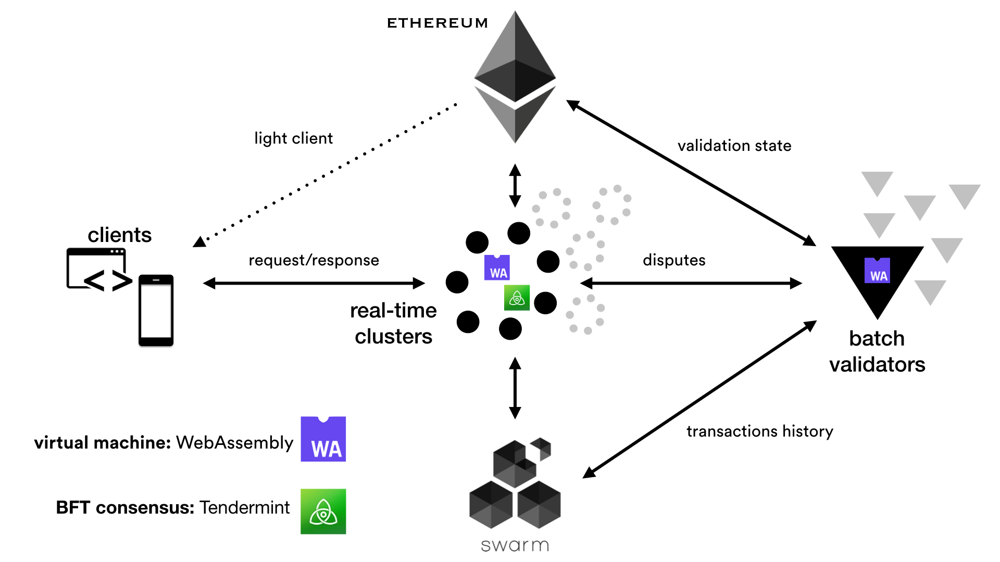

 

## What is Fluence?
Fluence is the efficient decentralized data processing network where anyone can install and run the compute node. Fluence attacks the `real-time execution | decentralized security | cost efficiency – (pick two)` trilemma using a **_hybrid real-time + batch approach_**.  

Real-time component allows to obtain computation results immediately with adequate but not necessarily absolute security guarantees. Batch component, on the contrary, performs a thorough verification of historical results and penalizes misbehaving nodes if it finds any discrepancy.  

Fluence heavily employs the existing decentralized technology stack. It uses [Ethereum](https://www.ethereum.org/) as the secure state storage, [Tendermint](https://tendermint.com/) as the BFT consensus engine for the real-time data processing, [WebAssembly](https://webassembly.org/) as the virtual machine for computations and, finally, [Ethereum Swarm](https://swarm-guide.readthedocs.io/en/latest/introduction.html) as the cold storage for the history of operations. For dispute resolution Fluence relies on the _verification game_ concept described in the [TrueBit paper](https://people.cs.uchicago.edu/~teutsch/papers/truebit.pdf).  

Because computation results returned in the real-time by Fluence to the (light) client are exhaustively verified only later, it is correct to say that Fluence provides _eventual security_ guarantees. In other words, the client is optimistic that real-time nodes will not turn out to be malicious. If this happens, however, Fluence network will evict such nodes by forfeiting their security deposits.

#### Fluence architecture

## Motivation

Building data intensive applications which would use a decentralized stack is not always easy. For example, it's not possible to expect a browser page or a mobile app to download gigabytes of the blockchain data and apply heavy computations to it. Full nodes might solve the problem, but the client has to trust them. Moreover, full nodes are not incentivized to process the client queries in time which might lead to delays. 

Ideally we would want a decentralized network to perform the data processing, and perform it with the real-time performance, securely and reasonably inexpensive compared to the traditional cloud processing. This is exactly what Fluence aims to become :)

Check out [this slide share](https://www.slideshare.net/AlexanderDemidko/fluence-a-decentralized-data-processing-engine) to learn more!

## Project status
The project is undergoing a heavy development at the moment.  
Check out the [issue tracker](https://github.com/fluencelabs/fluence/issues) to learn more about the current progress.

## Contributing
You are welcome to contribute. At the current moment we don't have detailed instructions on how to join development or which code guidelines to follow. However, you can expect more info to appear soon enough. In the meanwhile, check out the [basic contributing rules](./CONTRIBUTING.md).

## License
[Apache 2.0](./LICENSE.md)
