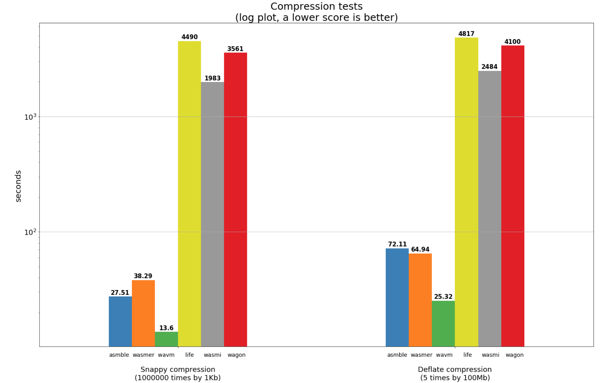
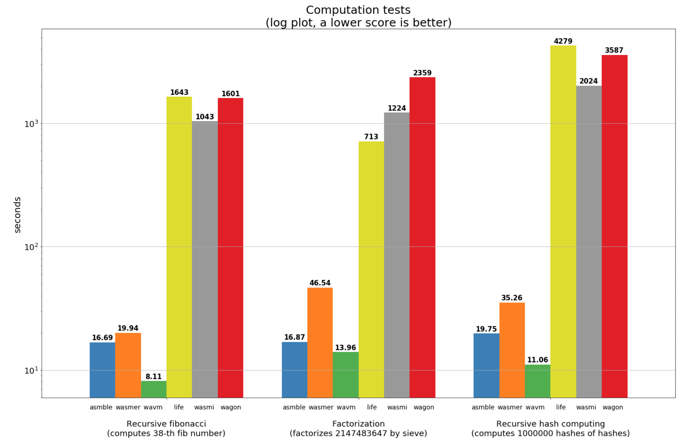
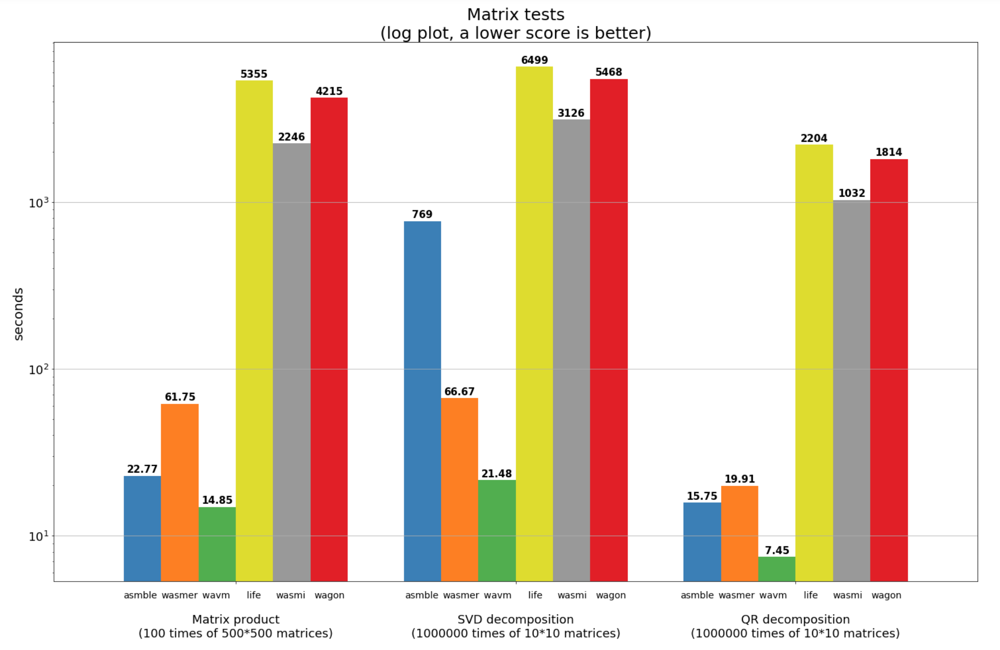

## A standalone WebAssembly VM benchmark

WebAssembly has become the computation machine of choice for a significant number of decentralized projects. While WebAssembly has already been supported for a while by the major browsers, standalone virtual machines are somewhat less common with [WAVM](https://github.com/WAVM/WAVM) probably being the oldest and most mature. Other virtual machines are catching up though.

For example, [Asmble](https://github.com/cretz/asmble) translates WebAssembly instructions into JVM bytecode which allows it to enjoy Java JIT compiler perks almost for free. [Wasmer](https://github.com/wasmerio/wasmer) compiles WebAssembly code into [Cranelift IR](https://cranelift.readthedocs.io/en/latest/ir.html) which is later translated into executable machine code by [Cranelift](https://github.com/CraneStation/cranelift). Aforementioned WAVM compiles WebAssembly into LLVM which is then translated into machine code as well. Not only compilers exist in the stack though: Parity develops [wasmi](https://github.com/paritytech/wasmi) – a WebAssembly interpreter in Rust. Perlin works on another interpreter named [life](https://github.com/perlin-network/life) in Go. There is also another WebAssembly interpreter written in Go: [wagon](https://github.com/go-interpreter/wagon).

We think it would be nice to (micro)benchmark existing WebAssembly VM implementations to help engineers make a better choice when selecting a VM for their needs. It’s not the first time standalone Wasm virtual machines are being benchmarked — for example, [here](https://github.com/perlin-network/life#benchmarks) you can find benchmark results published by the folks from Perlin. However, we have decided to focus on a somewhat different benchmark methodology. We think that lots of applications will load the WebAssembly code once and then keep running it for a long time which should let JIT compilation come into effect. In this case, the benchmark should run long enough so we could see those effects, and that’s exactly what we have tried to accomplish.

Each test in the benchmark was crafted in a way that would prevent the virtual machine from optimizing it using the dead code elimination. Most tests also prevent intermediate results memoization and allow the specification of an RNG seed to obtain repeatable benchmark results. As a semi-mandatory disclaimer, however, we should note that this benchmark is not, by definition, comprehensive and might not reflect performance on real life workloads.

### Tests

We have performed 8 tests, which source codes can be found [here](https://github.com/fluencelabs/fluence/tree/master/bench/vm/tests):

- `deflate` and `snappy` perform multiple compression iterations of a randomly generated byte sequence
- `factorization` factorizes the provided large integer number
- `fibonacci_bigint` computes `n`-th Fibonacci number
- `recursive_hash` computes a hash chain `hash(hash( ... hash(x)))` of the provided value `x`
- `matrix_product` performs multiple iterations of computing a product of random matrices
- `matrix_qr_decomposition` performs multiple iterations of a QR decomposition of a random matrix
- `matrix_svd_decomposition` performs multiple iterations of an SVD decomposition of a random matrix

### Setup

We have used the following virtual machines versions (tied to GitHub commits):

- [Asmble](https://github.com/fluencelabs/asmble/commit/1323e02c956286563a2c5284444140ffbae373f0) - a forked version of Asmble was used, but this shouldn't have too much effect
- [wasmer](https://github.com/wasmerio/wasmer/commit/3dc911989f26bceb4de85c190287e94648311b83)
- [WAVM](https://github.com/WAVM/WAVM/commit/c8fd181ddd85d96e0dce4734eb9560a4f1244eaf)
- [life](https://github.com/perlin-network/life/commit/6bf6615afaa9e9bef133fe24231b5a33581b920b)
- [wasmi](https://github.com/paritytech/wasmi/commit/da558c7ce71e8ede73f996a9e71f94a433baf1a8)
- [wagon](https://github.com/fluencelabs/wagon/commit/72f1344c76402ac01f8c8537575dbd36b6e61ade) – we had to hack the run script a little bit

All tests were performed on the `m4.large` AWS instance, and the script running benchmarks can be found [here](https://github.com/fluencelabs/fluence/tree/master/bench/vm/bencher).

It should be noted that a total execution time was measured which skews results a little bit. For example, the compilation time by WAVM is counted, but ideally shouldn’t be because the compilation should happen only once. The time for JVM to load the class file produced by Asmble is counted as well. We attempted to counteract this by having tests run long enough, but of course that’s far from perfect.

It should also be noted that in general, interpreter VMs took much longer time than compiler VMs, so we had to repeat the same tests only 3 times for interpreters and 11 times for compilers.

### Results

  

It should be somewhat expected that “compilers” (WAVM, Asmble, wasmer) will beat “interpreters” (life, wasmi, wagon) without JIT by a large margin, and WAVM is a clear winner here. You might also note that `deflate` is one of two tests where Asmble loses to wasmer.

  

`Factorization` is one of the tests where Asmble is almost on par with WAVM. That might be due to Java JIT compiler optimizing hot spots.

  

Matrix tests are the ones where the floating-point arithmetic is used (except the `matrix_product` test). It’s unclear why Asmble performs so poorly in the SVD decomposition test but performs fine in the QR decomposition test — that’s a subject for further investigation.

### Conclusion

WAVM was a definite winner in every test we have performed and “compilers” were up to 50x-200x faster when compared to “interpreters”. Asmble can be considered the runner up — on most tests, except one anomalous and another with deflate compression, it was only a couple times slower than WAVM and 1.2x-2x faster than wasmer.

Unfortunately, because we tried to run the same test on “compilers” and “interpreters”, we couldn’t make it run long enough for “compilers” without making “interpreters” run forever. This means that “compilers” results are potentially ballpark at best. Ideally, there should be another test focused on “compilers” only, and we would be grateful if someone from the community helped with that :)

Raw results can be found [here](https://github.com/fluencelabs/fluence/tree/master/bench/vm/results), and the Jupyter notebook used to generate the plots (with some additional analysis) – [here](https://github.com/fluencelabs/fluence/blob/master/bench/vm/results/result_analysis.ipynb). [Source codes](https://github.com/fluencelabs/fluence/tree/master/bench/vm/tests) and [benchmark scripts](https://github.com/fluencelabs/fluence/tree/master/bench/vm/bencher) are published as well, so feel free to try this at home!

Also, welcome to our [Gitter](https://gitter.im/fluencelabs/) if you have any additional thoughts about the benchmark!
