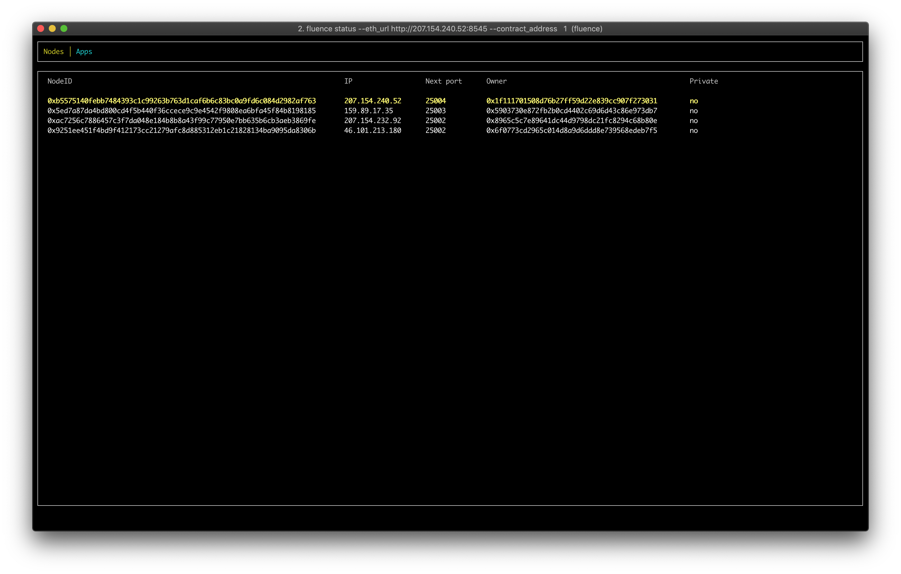
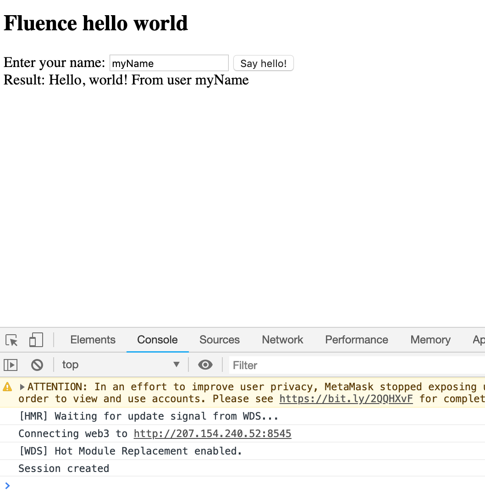

- [The plan](#the-plan)
- [Developing the backend app](#developing-the-backend-app)
  - [Setting up Rust](#setting-up-rust)
  - [Creating an empty Rust package](#creating-an-empty-rust-package)
  - [Optional: Creating a Hello World Rust application](#optional-creating-a-hello-world-rust-application)
  - [Creating a Fluence Hello World backend](#creating-a-fluence-hello-world-backend)
    - [Adding Fluence as a dependency](#adding-fluence-as-a-dependency)
    - [Implementing backend greeting logic](#implementing-backend-greeting-logic)
    - [Making it a library](#making-it-a-library)
    - [Compiling to WebAssembly](#compiling-to-webassembly)
- [Publishing your app](#publishing-your-app)
  - [Connect to Swarm and Ethereum Kovan](#connect-to-swarm-and-ethereum-kovan)
  - [TODO: Registering an Ethereum Kovan account](#todo-registering-an-ethereum-kovan-account)
  - [Installing Fluence CLI](#installing-fluence-cli)
  - [Publishing via Fluence CLI](#publishing-via-fluence-cli)
  - [Check app status](#check-app-status)
- [Frontend](#frontend)
  - [Preparing web app](#preparing-web-app)
  - [Running and using](#running-and-using)

This guide aims first-time users of Fluence. At the end, you will develop a dApp consisting of a decentralized backend running on top of Fluence network, and a web frontend application that's able to communicate with that backend. 

# The plan
This document is structured as follows.

First, you will use Fluence Rust SDK to develop a Rust backend, and compile it to WebAssembly. 

Then, you will publish compiled backend to the Fluence network.

And finally, you will build a web application integrated with your decentralized backend.

# Developing the backend app
## Setting up Rust
Let's get some Rust. 

Install rust compiler and it's tools:
```bash
# install Rust compiler and other tools to `~/.cargo/bin`
~ $ curl https://sh.rustup.rs -sSf | sh -s -- -y
info: downloading installer
...
Rust is installed now. Great!
To configure your current shell run source $HOME/.cargo/env
```

Let's listen to the installer and configure your current shell:
```bash
~ $ source $HOME/.cargo/env
<no output>
```

Fluence Rust SDK [uses custom allocator (TODO: link)](???) for more fine-grained control over virtual machine internal memory, and that requires nightly toolchain. To install nightly toolchain, run:
```bash
~ $ rustup toolchain install nightly
info: syncing channel updates ...
...
  nightly-<arch> installed - rustc 1.34.0-nightly (57d7cfc3c 2019-02-11)
```

To check nightly toolchain was installed succesfully:
```bash
~ $ rustup toolchain list | grep nightly
# output should contain nighly toolchain
...
nightly-<arch>
```

Also, to be able to compile Rust to WebAssembly, we need to add wasm32 compilation target. Just run the following:
```bash
# install target for WebAssembly
~ $ rustup target add wasm32-unknown-unknown --toolchain nightly
info: downloading component 'rust-std' for 'wasm32-unknown-unknown'
info: installing component 'rust-std' for 'wasm32-unknown-unknown'
```

To check that everything is set up correctly, let's compile some Rust code:

```bash
# create test.rs with a simple program that returns number 1
~ $ echo "fn main(){1;}" > test.rs

# compile it to wasm using rustc from nightly toolchain
~ $ rustup run nightly rustc --target=wasm32-unknown-unknown test.rs
<no output>

# check test.wasm was created
~ $ ls -la test.wasm
-rwxr-xr-x 1 user user 834475 Feb  7 08:12 test.wasm
```

If everything looks similar, then it's time to create a Rust hello-world project!

## Creating an empty Rust package
First, let's create a new empty Rust package:

```bash
# create empty Rust package
~ $ cargo +nightly new hello-world --edition 2018
Created binary (application) `hello-world` package

# go to the package directory
~ $ cd hello-world
~/hello-world $
```

More info on creating a new Rust project can be found in [Rust docs](https://doc.rust-lang.org/cargo/guide/creating-a-new-project.html).

## Optional: Creating a Hello World Rust application
If you are familiar with Rust, feel free to [skip](#creating-a-fluence-hello-world-backend) that section.

Let's write some code. Our backend should be able to receive a username from program arguments, and print greeting with the username in it.

Take a look at `src/main.rs`:
```bash
~/hello-world $ cat src/main.rs
```

You will see the following code. It's there by default:
```rust
fn main() {
    println!("Hello, world!");
}
```

It almost does what we need, except for reading a username. So, open `src/main.rs` in your editor, delete all the code in there, and paste the following:
```rust
use std::env;

fn greeting(name: String) -> String {
    format!("Hello, world! From user {}", name)
}

fn main() {
    let name = env::args().nth(1).unwrap();
    println!("{}", greeting(name));
}
```

What this code does:
1. Defines a `greeting` function that takes a name, and returns a greeting message
2. Defines a `main` function that reads first program argument, passes it to `greeting`, and prints the result

Let's now compile and run our example:
```bash
~/hello-world $ cargo +nightly run myName
   Compiling hello-world v0.1.0 (/root/hello-world)
    Finished dev [unoptimized + debuginfo] target(s) in 0.70s
     Running `target/debug/hello-world myName`
Hello, world! From user myName
```
***
**WARNING:** If you see the following error, you should install `gcc` and try `cargo +nightly run` again:
```bash
Compiling hello-world v0.1.0 (/root/hello-world)
error: linker cc not found
  |
  = note: No such file or directory (os error 2)

error: aborting due to previous error
error: Could not compile hello-world.
```
***

Now that we have a working hello world, it's time to adapt it to be used with Fluence.

## Creating a Fluence Hello World backend
For a backend to be compatible with Fluence network, it should [follow a few conventions](backend.md#wasm-program-conventions), so Fluence knows how to call your code correctly. To reduce boilerplate and make it easier, we developed a Fluence Rust SDK. Let's see how to use it.

### Adding Fluence as a dependency
First you need to add it to `Cargo.toml` as a dependency. Let's take a look at `Cargo.toml`:
```bash
~/hello-world $ cat Cargo.toml
```

It should look like this:
```toml
[package]
name = "hello-world"
version = "0.1.0"
authors = ["root"]
edition = "2018"

[dependencies]
```

Now, open `Cargo.toml` in your editor, and add `fluence` to `dependencies`:
```toml
[package]
name = "hello-world"
version = "0.1.0"
authors = ["root"]
edition = "2018"

[dependencies]
fluence = { version = "0.0.8", features = ["export_allocator"]}
```

### Implementing backend greeting logic
Create & open `~/hello-world/src/lib.rs` in your editor and paste the following code there:
```rust
use fluence::sdk::*;

#[invocation_handler]
fn greeting(name: String) -> String {
    format!("Hello, world! From user {}", name)
}
```

This code imports Fluence SDK, and marks `greeting` function with `#[invocation_handler]`, so Fluence knows how to call it.

Function marked with `#[invocation_handler]` is called a _gateway function_. It is an entrypoint to your application, all transactions sent by users will be passed to that function, and it's result will be available to users. Gateway function can receive and return either `String` or `Vec<u8>`. 

### Making it a library
For a gateway function to be exported and available for Fluence to call, backend should be compiled to WebAssembly as a library.

To make your backend a library, open `Cargo.toml` in your editor, and paste the following there:
```toml
[package]
name = "hello-world"
version = "0.1.0"
authors = ["root"]
edition = "2018"

[lib]
name = "hello_world"
path = "src/lib.rs"
crate-type = ["cdylib"]

[dependencies]
fluence = { version = "0.0.8", features = ["export_allocator"]}
```

### Compiling to WebAssembly
Run the following code to build a `.wasm` file from your Rust code.

NOTE: Downloading and compiling dependencies might take a few minutes.

```bash
~/hello-world $ cargo +nightly build --lib --target wasm32-unknown-unknown --release
    Updating crates.io index
    ...
    Finished release [optimized] target(s) in 1m 16s
```

If everything goes well, you should have a `.wasm` file deep in `target`. Let's check it:
```bash
~/hello-world $ ls -lh target/wasm32-unknown-unknown/release/hello_world.wasm
-rwxr-xr-x  2 user  user  1.4M Feb 11 11:59 target/wasm32-unknown-unknown/release/hello_world.wasm
```

# Publishing your app
## Connect to Swarm and Ethereum Kovan
To publish a backend app to Fluence network, you need to upload it to Swarm, and then send its location in Swarm to a Fluence smart contract on Ethereum Kovan testnet. 

To make sure we're on the same page:
- Swarm is a decentralized file storage. 
- Ethereum Kovan testnet is one of the many Ethereum networks, but there's no real money in there, so it's safe and can be used for trying out something new.
- Fluence smart contract is what rules the Fluence network and allows users to use it.

To upload your code to Swarm, you need to have access to one of its nodes. The same with Ethereum, you will need a connection to any Ethereum node on Kovan testnet.

**We will use existing Ethereum & Swarm nodes, but if you wish, you can [use your own nodes](miner.md) or any other.**

## TODO: Registering an Ethereum Kovan account
TODO

## Installing Fluence CLI
You can download Fluence CLI from here https://github.com/fluencelabs/fluence/releases/tag/cli-0.1.2

Or in terminal:

**Linux**
```bash
~ $ curl -L https://github.com/fluencelabs/fluence/releases/download/cli-0.1.2/fluence-cli-0.1.2-linux-x64 -o fluence
```

**macOS**
```bash
~ $ curl -L https://github.com/fluencelabs/fluence/releases/download/cli-0.1.2/fluence-cli-0.1.2-mac-x64 -o fluence
```

And finally don't forget to add permission to execute it:
```bash
~ $ chmod +x ./fluence

# check CLI is working
~ $ ./fluence --version
Fluence CLI 0.1.2
```

If you see CLI version, proceed to the next step.

## Publishing via Fluence CLI
As was mentioned before, you will need a connection to Ethereum Kovan network, and a connection to Swarm network. 

For your convenience, and to make this guide simple, we use addresses of existing Ethereum Kovan and Swarm nodes running in a cloud on Fluence nodes. **However, this is a centralized way to connect to Ethereum Kovan and Swarm networks, and shouldn't be used in production or in a security-sensitive context.** You may use **any** Kovan and Swarm nodes by providing their URIs within `--eth_url` and `--swarm_url` options (see below).

Also you will need a Kovan account with some money on it (you can [get money from faucet](https://github.com/kovan-testnet/faucet)) and it's private key. Private key can be either a hex string or a [JSON keystore file](../cli/README.md#keystore-json-file).

Having all that, you're now ready to publish your app. Examples below will specify a cluster size of 4 nodes for your app. Adjust it to your needs.

If you have your private key **in hex**, run the following in your terminal, replacing `<>` with actual values:
```bash
~ $ ./fluence publish \
            --eth_url          http://207.154.240.52:8545 \
            --swarm_url        http://207.154.240.52:8500 \
            --code_path        ~/hello-world/target/wasm32-unknown-unknown/release/hello_world.wasm \
            --contract_address 0xd62ab1bd71068a252bb20fa94b2f536d7525cfeb \
            --gas_price        10 \
            --account          <your ethereum address> \
            --secret_key       <your ethereum private key> \
            --cluster_size     4 \
            --wait_syncing \
            --wait
```

If you have a JSON **keystore file**, run the following in your terminal, replacing `<>` with actual values:

```bash
~ $ ./fluence publish \
            --eth_url          http://207.154.240.52:8545 \
            --swarm_url        http://207.154.240.52:8500 \
            --code_path        ~/hello-world/target/wasm32-unknown-unknown/release/hello_world.wasm \
            --contract_address 0xd62ab1bd71068a252bb20fa94b2f536d7525cfeb \
            --gas_price        10 \
            --account          <your ethereum address> \
            --keystore         <path to keystore> \
            --password         <password for keystore> \
            --cluster_size     4 \
            --wait_syncing \
            --wait
```
There is more info on using keystore files with Fluence CLI in it's [README](../cli/README.md#keystore-json-file).


After running the command, you will see an output similar to the following:
```bash
[1/3]   Application code uploaded. ---> [00:00:00]
swarm hash: 0xf5c604478031e9a658551220da3af1f086965b257e7375bbb005e0458c805874
[2/3]   Transaction publishing app was sent. ---> [00:00:03]
  tx hash: 0x5552ee8f136bce0b020950676d84af00e4016490b8ee8b1c51780546ad6016b7
[3/3]   Transaction was included. ---> [00:02:38]
App deployed.
  app id: 2
  tx hash: 0x5552ee8f136bce0b020950676d84af00e4016490b8ee8b1c51780546ad6016b7
```


## Check app status
To see how smart contract sees your app, and what nodes it was deployed onto, you can use `status` like this:
```bash
~ $ ./fluence status \
            --eth_url          http://207.154.240.52:8545 \
            --contract_address 0xd62ab1bd71068a252bb20fa94b2f536d7525cfeb \
            --app_id           <your app id here>
```

The output will be in JSON, and look similar to the following:
```json
{
  "apps": [
    {
      "app_id": "<your app id here>",
      "storage_hash": "<swarm hash>",
      "storage_receipt": "0x0000000000000000000000000000000000000000000000000000000000000000",
      "cluster_size": 4,
      "owner": "<your ethereum address>",
      "pin_to_nodes": [],
      "cluster": {
        "genesis_time": 1549353504,
        "node_ids": [
          "0x5ed7aaada4bd800cd4f5b440f36ccece9c9e4542f9808ea6bfa45f84b8198185",
          "0xb557bb40febb7484393c1c99263b763d1caf6b6c83bc0a9fd6c084d2982af763",
          "0xac72ccc7886457c3f7da048e184b8b8a43f99c77950e7bb635b6cb3aeb3869fe",
          "0x9251dd451f4bd9f412173cc21279afc8d885312eb1c21828134ba9095da8306b",
        ],
        "ports": [
          25001
        ]
      }
    }
  ],
  "nodes": [
    {
      "validator_key": "0x5ed7a87da4bd800cd4f5b440f36ccece9c9e4542f9808ea6bfa45f84b8198185",
      "tendermint_p2p_id": "0x6c03a3fe792314f100ac8088a161f70bd7d257b1",
      "ip_addr": "43.32.21.10",
      "next_port": 25003,
      "last_port": 25099,
      "owner": "0x5902720e872fb2b0cd4402c69d6d43c86e973db7",
      "is_private": false,
      "app_ids": [
        1,
        2,
        6
      ]
    },
    "<3 more nodes here>"
  ]
}
```

You can also use interactive mode instead of default by supplying `--interactive` flag:
```bash
./fluence status \
            --eth_url          http://207.154.240.52:8545 \
            --contract_address 0xd62ab1bd71068a252bb20fa94b2f536d7525cfeb \
            --app_id           <your app id here> \
            --interactive
```

<div style="text-align:center">

<br><br><br>
</div>

You can press `q` to exit it.

Your backend now is successfully deployed! You can proceed to access your code from a web browser.

# Frontend
For this part, you will need installed `npm`. Please refer to [npm docs](https://www.npmjs.com/get-npm) for installation instructions.

## Preparing web app
Let's clone a simple web app template:
```bash
~ $ git clone https://github.com/fluencelabs/frontend-template
~ $ cd frontend-template
~/frontend-template $ 
```

There are just three files (except for README, LICENSE and .gitignore):
- `package.json` that declares needed dependencies
- `webpack.config.js` needed for the webpack to work
- `index.js` that imports `fluence` js library and shows how to connect to a cluster

Let's take a look at `index.js`:
```javascript
...
// create a session between client and backend application
fluence.connect(contractAddress, appId, ethUrl).then((s) => {
  console.log("Session created");
  window.session = s;
  helloBtn.disabled = false;
});
...
// set callback on button click
helloBtn.addEventListener("click", send)

// send username as a transaction and display results in grettingLbl
function send() {
  const username = usernameInput.value.trim();
  let result = session.invoke(username);
  getResultString(result).then(function (str) {
    greetingLbl.innerHTML = str;
  });
}
```

This code queries the Fluence smart contract for IP addresses of Tendermint nodes hosting the app with specified `appId`, creates an `AppSession` from these connections, and saves it to `window.session`, so it can be used later. All this is done via `connect` method. 

Then, it assigns `send()` function as a callback for clicking the button, which will call an `invoke` method provided by `AppSession`. `invoke` takes a `String`, and sends it to the backend as a transaction. Result will be displayed in `greeting` label.

## Running and using
Please make sure you have changed `appId` to your actuall appId.

To install all dependencies, compile and run the application, run in the terminal:
```bash
~/frontend-template $ npm install
~/frontend-template $ npm run start
> frontend-template@1.0.0 start /private/tmp/frontend-template
> webpack-dev-server

ℹ ｢wds｣: Project is running at http://localhost:8080/
...
```

Now you can open http://localhost:8080/ in your browser. You will see an input text box and a disabled button. Button will become enabled once AppSession is created. You can enter your name, and press `Say hello!` button, and greeting will be displayed next to `Result:`.

You can also open Developer Console, and you'll see a log about session creation:
```
...
Connecting web3 to http://207.154.240.52:8545
...
Session created
```

<div style="text-align:center">
<kbd>

</kbd>
<br><br><br>
</div>

You can also use Fluence from within Developer console as follows:
```javascript
let result = session.invoke("myName");
<undefined>
logResultAsString(result);
<undefined>
Hello, world! From user myName
```
