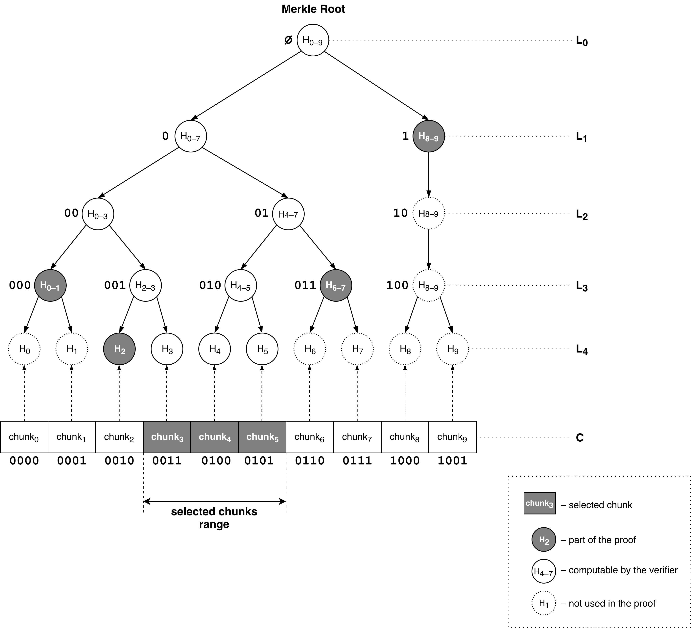
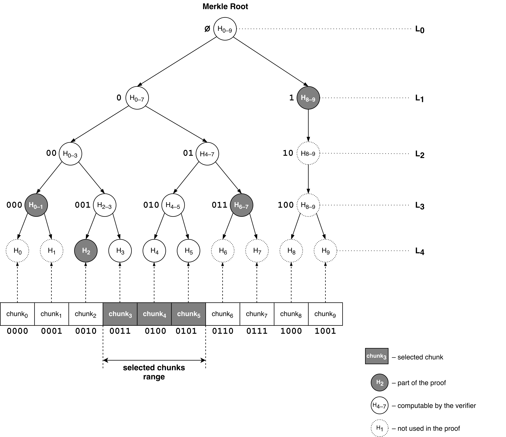

# Protocol

- [Protocol](#protocol)
  - [Preface](#preface)
  - [Core](#core)
    - [Basics](#basics)
    - [Cryptographic primitives](#cryptographic-primitives)
    - [Range Merkle proofs](#range-merkle-proofs)
  - [External systems](#external-systems)
    - [Ethereum](#ethereum)
    - [Swarm](#swarm)
  - [Initial setup](#initial-setup)
  - [Transactions](#transactions)
  - [Sidechain](#sidechain)
  - [Real-time processing](#real-time-processing)
    - [Transaction validation](#transaction-validation)
    - [Tendermint block formation](#tendermint-block-formation)
    - [Block processing](#block-processing)
    - [Query response](#query-response)
  - [Client](#client)
    - [Query response verification](#query-response-verification)
      - [Prerequisites](#prerequisites)
      - [Verification of Swarm receipts](#verification-of-swarm-receipts)
      - [Verification of consensus on the virtual machine state](#verification-of-consensus-on-the-virtual-machine-state)
      - [Verification of Merkle proofs for returned VM state chunks](#verification-of-merkle-proofs-for-returned-vm-state-chunks)
  - [Batch validation](#batch-validation)
    - [Transactions history downloading](#transactions-history-downloading)
    - [State snapshots](#state-snapshots)
    - [History replaying](#history-replaying)
    - [State hash mismatch resolution](#state-hash-mismatch-resolution)
    - [Validators selection](#validators-selection)
  - [Computation machine](#computation-machine)
    - [Client interactions](#client-interactions)
    - [Virtual machine](#virtual-machine)
    - [Verification game](#verification-game)
      - [WebAssembly package](#webassembly-package)
      - [Dispute initiation](#dispute-initiation)
      - [Trace length mismatch resolution](#trace-length-mismatch-resolution)
      - [Verification game](#verification-game)

## Preface

This protocol specification describes one simple thing: how a (light) client interacting with the Fluence network will become convinced that whatever results the network has supplied to it in the real-time will be validated later on in the batch mode, and if any discrepancy found during the validation – that offending nodes will be penalized.

This document is not a replacement for a white paper or a design proposal; it doesn't discuss **why** certain things should work the way they are described, neither it specifies **how** things would work on the technical level. Most likely parts of it will get absorbed by the future white paper describing the Fluence network architecture or a more detailed specification allowing to independently implement a network node. 

However, at least for now this specification aims to accurately express **what** _conceptually_ happens in the network, and let developers have a single point of synchronization. We also hope it will give some intuition that the construction is secure – an intuition that is expected to be proven more formally in the future yellow paper.

## Core

### Basics

Before we start describing the protocol, few words need to be said about the core building blocks. 

First of all, we use a simplified version of Go as a pseudocode to illustrate chosen algorithms. It should be noted that the reference Fluence network implementation doesn't use Go: in fact, it's mostly Scala, TypeScript and Rust. However, Go simplicity allows to use it to describe complex algorithms without too much boilerplate. Go is also statically typed, which allows to use a compiler to catch at least some mistakes. Source codes used in this specification can be found 
[here](./protocol).

We assume that few pretty simple library functions are available in this specification. `assertTrue` and `assertEq` will panic if the boolean or equality condition doesn't hold. `pack` and `packMulti` will serialize an input into the byte array or few byte array chunks.

```go
type Chunk = []byte

// panics if the condition is false
func assertTrue(condition bool) {}

// panics if the condition is false
func assertEq(x, y interface{}) {}

// serializes arguments to a byte array
func pack(args... interface{}) []byte {}

// serializes elements of a compound object (array or structure) into byte arrays
func packMulti(object interface{}) []Chunk {} 
```

### Cryptographic primitives

Basic cryptographic primitives such as digital signature generation and verification, as well as cryptographic hash computation are listed below and used throughout the rest of the protocol specification. We do not specify exact algorithms such as SHA3, RIPEMD or EdDSA for those primitives but still assume them to behave according to the common expectations.

```go
type Digest     = [32]byte
type PublicKey  = [32]byte
type PrivateKey = [64]byte
type Signature  = [64]byte

type Seal struct {
  PublicKey PublicKey
  Signature Signature
}

// computes a cryptographic hash of the input data
func Hash(data []byte) Digest {}

// produces a digital signature for the input data digest
func Sign(publicKey PublicKey, privateKey PrivateKey, digest Digest) Seal {}

// verifies that the input data digest is signed correctly
func Verify(seal Seal, digest Digest) bool {}
```

### Range Merkle proofs

This protocol uses a variation of the Merkle proof algorithm allowing to verify not only an inclusion of a chunk into the original byte sequence, but also its index in the original sequence. Furthermore, it allows to construct a single proof for a contiguous range of chunks.

To construct the Merkle proof, a sequence of bytes first has to be split into multiple chunks. Chunk size might vary, but by default `4KB` chunk size is used.

```go
// splits the byte sequence into chunks of specific size
func Split(data []byte, chunkSize int32) []Chunk {}
```

Once the list of chunks is produced, a typical Merkle tree can be build on top of it. On the diagram below we can use a binary encoding of the tree nodes: on each layer <code>L<sub>k</sub></code> the node would have an index <code>a<sub>1</sub>...a<sub>k</sub></code> where <code>a<sub>k</sub></code> equals `0` if it's the left sibling and `1` if it's the right one.

<p align="center">
  
</p>

The Merkle proof itself is constructed recursively by layers. First, a hash function is applied to every chunk on the layer `C` generating the layer <code>L<sub>n</sub></code> where `n` is the tree depth. Now, starting from the layer <code>L<sub>n</sub></code> we iterate to the layer <code>L<sub>0</sub></code> in the following way. 

_Expand._ On the layer <code>L<sub>n</sub></code> we have a contiguous sequence of hashes having indices ranging from <code>a<sub>1</sub>...a<sub>n–1</sub>a<sub>n</sub></code> to <code>b<sub>1</sub>...b<sub>n–1</sub>b<sub>n</sub></code>. We expand this sequence to contain hashes from <code>a<sub>1</sub>...a<sub>n–1</sub>0</code> to <code>b<sub>1</sub>...b<sub>n–1</sub>1</code>. It's obvious to see that at most two hashes are added on the left and on the right side – these hashes will be sent as a part of the Merkle proof. 

_Lift._ Combining hashes pairwise and applying the hash function we can compute hashes for the next level: a pair <code>(x<sub>1</sub>...x<sub>n–1</sub>0, x<sub>1</sub>...x<sub>n–1</sub>1)</code> on the level <code>L<sub>n</sub></code> produces the hash <code>x<sub>1</sub>...x<sub>n–1</sub></code> on the level <code>L<sub>n–1</sub></code>. It should be clear that for every index <code>x<sub>1</sub>...x<sub>n–1</sub></code> such that <code>a<sub>1</sub>...a<sub>n–1</sub> ≤  x<sub>1</sub>...x<sub>n–1</sub> ≤ b<sub>1</sub>...b<sub>n–1</sub></code> the aforementioned pair would belong to the extended sequence of hashes <code>[a<sub>1</sub>...a<sub>n–1</sub>0;  b<sub>1</sub>...b<sub>n–1</sub>1]</code>.

This construction means we have collected a sequence of hashes <code>[a<sub>1</sub>...a<sub>n–1</sub>;  b<sub>1</sub>...b<sub>n–1</sub>]</code> for the layer <code>L<sub>n–1</sub></code>. Now we can repeat expansion and lift procedures for the next layer until the Merkle root is reached. Note that if the selected chunks range contains just a single chunk, this algorithm virtually generates an ordinary Merkle Proof.

On each layer we have added at most two hashes, so the final Merkle proof looks the following:

```go
type MerkleProofLayer struct {
  left  *Digest
  right *Digest
}

type RangeMerkleProof struct {
  Layers []MerkleProofLayer
}
```

For our example tree, the proof is presented below.

<p align="center">
  
</p>

Proof can be generated using the following method:

```go
// build Range Merkle Proof for the range of chunks
func BuildMerkleRangeProof(chunks []Chunk, from int32, to int32) RangeMerkleProof {}
```

Proof verification happens in the way similar to how it was constructed. The verifier starts with the lowest level <code>L<sub>n</sub></code> and goes upward by combining already known hashes with hashes supplied in the Merkle proof. If eventually the already known Merkle root is produced, the proof is deemed correct. 

Note that if for the layer <code>L<sub>k</sub></code> we use `0` as <code>p<sub>k</sub></code> if the left extension hash is not present and `1` if it is, resulting <code>p<sub>1</sub>...p<sub>k</sub></code> index will be equal to the start chunk index in the chunks range. That happens because in our construction we were expanding the sequence of hashes to the left if and only if the left most hash in the sequence had the index of form <code>a<sub>1</sub>...a<sub>k–1</sub>1</code>. 

This means the verifier is able to compute the start and stop chunk indices positions based on the supplied proof.

Sometimes we might need to construct a proof for a subsequence of bytes which is not aligned with chunks boundaries. Dealing with this situation is fairly trivial: bounds of such subsequence can be extended to match chunks. Now, the prover can send the extended data range to the verifier along with chunk-based Merkle proof.

<p align="center">
  
</p>


## External systems

### Ethereum

For the purposes of this protocol specification, Ethereum is viewed as a secure state storage keeping few related smart contracts. For example, we can define a smart contract storing security deposits of the network participants.

```go
type ExampleContract struct {
  Deposits map[PublicKey]int64 // security deposits: node identifier –> deposit size
}
```

Such contract might have a method defined on it to be called by Ethereum clients. The difference between the method and an ordinary function is that a method would carry the contract as a receiver: `func (contract ExampleContract) foobar()`. In this protocol specification we pretend that the function defined as **a contract method is executed by the entire Ethereum network**. As a consequence, we can trust the changes it makes to the contract data.

```go
func (contract ExampleContract) MakeDeposit(size int64, seal Seal) {
  if Verify(seal, Hash(pack(size))) {
    // the deposit size is really signed with the node private key, updating the contract data
    contract.Deposits[seal.PublicKey] += size
  }
}
```

Any network participant can read the contract data to, for example, make sure that a certain node still has a security deposit placed. Note that while the function below also accepts a contract as an argument, _it is not a contract method_ and is executed by a single potentially malicious agent. We can't trust its results unless additional measures (such as BFT consensus) are used.

```go
func VerifyDeposit(contract ExampleContract, nodeId PublicKey, minDeposit int64) bool {
  return contract.Deposits[nodeId] >= minDeposit
}
```

### Swarm

In this specification we treat Swarm as a decentralized storage where a content can be accessed by its hash. Swarm has it's own set of cryptographic primitives which we don't expect to be compatible with Fluence core primitives.

```go
// listed Swarm functions carry the same meaning and arguments as core functions
func SwarmHash(data []byte) Digest {}
func SwarmSign(publicKey PublicKey, privateKey PrivateKey, digest Digest) Seal {}
func SwarmVerify(seal Seal, digest Digest) bool {}
```

We assume that every node serving in the Swarm network has an identifier and a public/private key pair and is registered in the Ethereum smart contract.

```go
type SwarmContract struct {
  Deposits map[PublicKey]int64 // security deposits: node identifier –> deposit size
}
```

We assume that Swarm provides an upload function which returns a Swarm receipt indicating Swarm network accountability for the passed content. The receipt contains the Swarm hash of the content and the signature of the Swarm node which is financially responsible for storing the content. Using the provided receipt, any Swarm client can download the content from the Swarm network.

Receipts functionality is not implemented yet in the current Swarm release, however it's described in details in the ["Swap, swear and swindle: incentive system for Swarm"](https://swarm-gateways.net/bzz:/theswarm.eth/ethersphere/orange-papers/1/sw^3.pdf) paper and can be reasonably expected to be rolled out some time soon.

```go
type SwarmReceipt struct {
  ContentHash Digest // Swarm hash of the stored content
  Insurance   Seal   // insurance written by the Swarm node for the accepted content
}

// uploads the content to the Swarm network, returns a receipt of responsibility
func SwarmUpload(content []byte) SwarmReceipt {}

// downloads the content from the Swarm network using the supplied receipt
func SwarmDownload(receipt SwarmReceipt) []byte {}
```

## Initial setup

There are few different actor types in the Fluence network: clients, real-time nodes forming Tendermint clusters and batch validators. Every node has an identifier, a public/private key pair and a security deposit, and is registered in the Fluence smart contract.

```go
type BasicFluenceContract struct {
  ClientDeposits     map[PublicKey]int64 // clients: identifier –> deposit size
  NodesDeposits      map[PublicKey]int64 // real-time nodes: identifier –> deposit size
  ValidatorsDeposits map[PublicKey]int64 // batch validators: identifier –> deposit size
}
```

## Transactions

A transaction always has a specific authoring client and carries all the information required to execute a deployed WebAssembly function:

```go
type Transaction struct {
  Invoke []byte // function name & arguments + required metadata
  Seal   Seal   // client signature
}

type Transactions = []Transaction
```

## Sidechain

For this protocol we need some kind of a sidechain that would periodically checkpoint selected blocks to the root chain – Ethereum. Blocks stored in this sidechain are really tiny compared to the overall data volumes flowing through the network. Normally they contain only receipts of the data stored in Swarm and producers signatures.

<p align="center">
  
</p>

Fluence smart contract stores checkpoints and allows to locate specific ones by history or by the block height.

```go
type SideBlock struct {
  Height        int64        // side block height
  PrevBlockHash Digest       // hash of the previous side block
  Receipt       SwarmReceipt // Swarm receipt for the content associated with the side block
  Signatures    []Seal       // signatures of the side block producers
}

type SideFluenceContract struct {
  base                  BasicFluenceContract // parent contract
  SideNodesDeposits     map[PublicKey]int64  // sidechain nodes: identifier –> deposit size
  
  CheckpointInterval    int64                // how often blocks should be checkpointed
  Checkpoints           []SideBlock          // block checkpoints
  CheckpointsByHeight   map[int64]SideBlock  // block height –> block
  CheckpointsSignatures map[int64][]Seal     // block height –> sidechain nodes signatures
}
```

It is expected that every sidechain node stores the tail of the chain starting from the last block checkpointed into the contract. Every node verifies there are no forks or incorrect references in the stored chain tail – otherwise, a dispute is submitted to the contract and offending block producers lose their deposits.

```go
// punishes block producers if blocks are not linked correctly
func (contract SideFluenceContract) DisputeReference(block SideBlock, nextBlock SideBlock) {
  if nextBlock.PrevBlockHash != Hash(pack(block)) && nextBlock.Height == block.Height+1 {
    
    // violation! let's punish producers signed the next block!
    for _, seal := range nextBlock.Signatures {
      contract.base.NodesDeposits[seal.PublicKey] = 0
    }
  }
}

// punishes block producers if a fork is present
func (contract SideFluenceContract) DisputeFork(block1 SideBlock, block2 SideBlock) {
  if block1.PrevBlockHash == block2.PrevBlockHash {
    
    // violation! let's punish producers signed both blocks!
    var m = make(map[PublicKey]bool)
    for _, seal := range block1.Signatures {
      m[seal.PublicKey] = true
    }
    
    for _, seal := range block2.Signatures {
      if m[seal.PublicKey] {
        contract.base.NodesDeposits[seal.PublicKey] = 0
      }
    }
  }
}
```

Every sidechain node also verifies that a checkpointing was performed correctly – i.e. there is a correct block being uploaded to the contract every period of time. Otherwise, another dispute is submitted to the contract, but this time a sidechain node that has uploaded an incorrect checkpoint block will lose a deposit.

```go
// punishes sidechain nodes if the block is checkpointed incorrectly
func (contract SideFluenceContract) DisputeCheckpoint(index int, blocks []SideBlock) {
  var prevCheckpoint = contract.Checkpoints[index-1]
  var checkpoint = contract.Checkpoints[index]

  // checking that the chain is linked correctly
  for i, block := range blocks {
    var prevBlock SideBlock
    if i == 0 {
      prevBlock = prevCheckpoint
    } else {
      prevBlock = blocks[i-1]
    }
    if block.PrevBlockHash != Hash(pack(prevBlock)) || (block.Height != prevBlock.Height+1) {
      // incorrect subchain, nothing to do here
      return
    }
  }

  if Hash(pack(blocks[len(blocks)-1])) != Hash(pack(checkpoint)) {
    // violation! let's punish sidechain nodes uploaded the checkpoint!
    for _, seal := range contract.CheckpointsSignatures[checkpoint.Height] {
      contract.SideNodesDeposits[seal.PublicKey] = 0
    }
  }
}
```

Every sidechain node allows producers to upload a new block to it and returns a signature if the block was accepted. Honest sidechain nodes would accept the block if and only if it doesn't violate an integrity of the sidechain tail.

```go
type SideNode struct {
  Tail []SideBlock
}

// appends the block to the chain tail and checks it doesn't violate correctness properties
func (node SideNode) UploadBlock(block SideBlock) Seal {}
```

Honest sidechain nodes will eventually checkpoint stored blocks to the smart contract and submit a dispute to Ethereum shall they notice any violation. This means a client needs only few signatures of the relevant sidechain nodes to have a confidence that the block that was uploaded to the sidechain is the correct one and won't be lost.

## Real-time processing

### Transaction validation

Once the client has constructed a transaction, it is submitted to one of the real-time nodes which checks the received transaction:

```go
// verifies that a transaction was originated by the client with enough funds deposited
func VerifyTransaction(contract BasicFluenceContract, tx Transaction, minDeposit int64){
  // checking that the client actually exists in the contract
  var deposit, ok = contract.ClientDeposits[tx.Seal.PublicKey]
  assertTrue(ok)

  // checking that the client has enough funds
  assertTrue(deposit >= minDeposit)

  // checking that the transaction was signed by this client
  assertTrue(Verify(tx.Seal, Hash(tx.Invoke)))
}
```

If the transaction passes the check, it's added to the mempool and might be later used in forming a block, otherwise the transaction is declined. While the transaction _might_ be used in a block, the node doesn't (and in fact, is unable to if the rest of the cluster is malicious) provide any guarantees it will be included into the block or processed by the cluster.


### Tendermint block formation

Tendermint consensus engine produces new blocks filled with the client supplied transactions and feeds them to the Fluence state machine.

```go
type Block struct {
  Header     Header       // block header
  LastCommit []Seal       // Tendermint nodes votes for the previous block
  Txs        Transactions // transactions as sent by clients
}

type Header struct {
  LastBlockHash  Digest // Merkle root of the previous block header fields
  LastCommitHash Digest // Merkle root of the last commit votes
  TxsHash        Digest // Merkle root of the block transactions
  AppHash        Digest // application state hash after the previous block
}
```

Tendermint uses Merkle trees to compute the Merkle root of certain pieces of data and digital signatures to sign produced blocks, however here we assume these functions are not necessary compatible with Fluence and denote them separately.

```go
// listed Tendermint functions carry the same meaning and arguments as core functions
func TmSign(publicKey PublicKey, privateKey PrivateKey, digest Digest) Seal {}
func TmVerify(seal Seal, digest Digest) bool {}
func TmMerkleHash(chunks []Chunk) Digest {}
```

Tendermint periodically pulls few transactions from the mempool and forms a new block. Nodes participating in consensus sign produced blocks, however their signatures for a specific block are available only as a part of the next block.

```go
// Tendermint real-time node
type RealtimeNode struct {
  PublicKey  PublicKey
  privateKey PrivateKey
}

// signs the block assuming the node has voted for it during consensus settlement
func (node RealtimeNode) SignBlockHash(blockHash Digest) Seal {
  return TmSign(node.PublicKey, node.privateKey, blockHash)
}

// prepares the block (assuming the nodes have reached a consensus)
func PrepareBlock(nodes []RealtimeNode, prevBlock Block, txs Transactions, appHash Digest) Block {
  var lastBlockHash = TmMerkleHash(packMulti(prevBlock.Header))
  var lastCommit = make([]Seal, 0, len(nodes))
  for i, node := range nodes {
    lastCommit[i] = node.SignBlockHash(lastBlockHash)
  }

  return Block{
    Header: Header{
      LastBlockHash:  lastBlockHash,
      LastCommitHash: TmMerkleHash(packMulti(lastCommit)),
      TxsHash:        TmMerkleHash(packMulti(txs)),
      AppHash:        appHash,
    },
    LastCommit: lastCommit,
    Txs:        txs,
  }
}
```

Note we haven't specified here how the application state hash (`Block.Header.AppHash`) is getting calculated – this will be described in the next section.

### Block processing

Once the block has passed through Tendermint consensus, it is delivered to the state machine. State machine passes block transactions to the WebAssembly VM causing the latter to change state. The virtual machine state is essentially a block of memory that can be split into chunks to compute the virtual machine Merkle Root. We can say that the virtual machine state `k + 1` is derived by applying transactions in the block `k` to the virtual machine state `k`.

```go
type WasmCode = []Chunk

type VMState struct {
  Memory []byte // virtual machine contiguous memory
}

// produces the new state by applying block transactions to the old VM state
func NextVMState(code WasmCode, vmState VMState, txs Transactions) VMState {}
```

Once the block is processed by the WebAssembly VM, it has to be stored in Swarm for the future batch validation. Two separate pieces are actually stored in Swarm for each Tendermint block: the block manifest and the transactions list.

```go
type Manifest struct {
  Header              Header       // block header
  VMStateHash         Digest       // Merkle Root of the VM state derived by applying the block
  LastCommit          []Seal       // Tendermint nodes signatures for the previous block header
  TxsReceipt          SwarmReceipt // Swarm hash of the block transactions
  LastManifestReceipt SwarmReceipt // Swarm hash of the previous manifest
}
```

 Every manifest contains the Swarm hash of the transactions list, which makes it possible to find transactions by having just the manifest. Every manifest also contains the Swarm hash of the previous manifest which allows to retrieve the entire history by having just a single Swarm receipt for the latest manifest.

<p align="center">
  
</p>

To create a manifest, the node splits the block into pieces, computes the hash of the new virtual machine state, uploads transactions to Swarm and adds links to the necessary Swarm content. Also, once the block manifest is crafted, it's hash is used as the new application state hash stored in the next block header. This way, because Tendermint nodes that have reached consensus sign the block header, they also confirm that the new manifest and the new virtual machine state were accepted.

```go
// returns the new virtual machine state, the manifest for the stored block and the next app hash
func ProcessBlock(code WasmCode, block Block, prevVMState VMState, prevManifestReceipt SwarmReceipt,
) (VMState, Manifest, SwarmReceipt, Digest) {
  var vmState = NextVMState(code, prevVMState, block.Txs)
  var txsReceipt = SwarmUpload(pack(block.Txs))

  var manifest = Manifest{
    Header:              block.Header,
    VMStateHash:         MerkleRoot(vmState.Memory),
    LastCommit:          block.LastCommit,
    TxsReceipt:          txsReceipt,
    LastManifestReceipt: prevManifestReceipt,
  }
  var receipt = SwarmUpload(pack(manifest))
  var nextAppHash = Hash(pack(manifest))

  return vmState, manifest, receipt, nextAppHash
}
```

### Query response

Once the cluster has reached consensus on the block, advanced the virtual machine state, reached consensus on the next couple of blocks and saved related block manifests and transactions into Swarm, the client can query results of the function invocation through the ABCI query API. 

Let's assume the transaction sent by the client was included into the block `k`. In this case the client has to wait until the block `k + 2` is formed and block manifests for the corresponding three blocks are uploaded to Swarm. Once this is done, the response returned to the client will look the following:

```go
type QueryResponse struct {
  MemoryRegion MemoryRegion // region of the virtual machine memory containing query result
  Proof        MerkleProof  // Merkle Proof for `Memory` belonging to the whole VM memory
  Manifests    [3]Manifest  // block manifests
}
```

Results obtained by invoking the function are stored as a part of the virtual machine state. This way, the node can return selected region of the virtual machine memory and supply a Merkle proof confirming the region indeed correspond to the correct virtual machine state's Merkle root.

```go
// prepares the query response containing memory region with results
func MakeQueryResponse(manifests [3]Manifest, vmState VMState, offset int32, length int32) QueryResponse {
  var proof = CreateMerkleProof(vmState.Memory, offset, length)
  var memoryRegion = MakeMemoryRegion(vmState.Memory, offset, length)

  return QueryResponse {
    MemoryRegion: memoryRegion, 
    Proof: proof, 
    Manifests: manifests,
  }
}
```

The reason why do we need multiple manifests in response is that nodes are required to prove that a consensus was reached on the manifest `k`. `AppHash` in the manifest `k + 1` header points to the manifest `k` content, and `LastBlockHash` in the manifest `k + 2` header points to the manifest `k + 1` header. Also, `LastCommit` field in the manifest `k + 2` provides nodes signatures for the `LastBlockHash`. A client can follow those links and verify the consistency of obtained results.

<p align="center">
  
</p>

## Client

### Query response verification

The client verifies that returned response represents a correct block progress in a few steps. Below we will list those steps, but first we need to mention that they are not verifying that the transaction sent by the client was actually processed.

Instead, all the client does verify here is that the virtual machine state progress made by executing the block `k` was saved properly in Swarm for the future batch validation. In this case, if the state transition was performed incorrectly, real-time nodes deposits will be slashed.

However, an all-malicious cluster might never include the transaction sent by the client. In this case the new virtual machine state won't have the corresponding function return value. It might also happen that a malicious cluster will include an invalid transaction into the block. For example, that might be a transaction that was never originated by the correct client but still changing the state.

These aspects will be considered in another section, and for now we will focus on how the block progress is being verified.

**[???]** Do we need to supply the SwarmReceipt for the last manifest?  
**[TODO]** We should describe how these manifests are stored/verified using the sidechain.

#### Prerequisites

Below we assume that functions allowing to verify that Swarm receipts and Tendermint signatures were created by valid nodes already exist.

```go
func VerifySwarmReceipt(contract SwarmContract, receipt SwarmReceipt) {
  var minDeposit int64 = 1000000

  // checking that the Swarm node has enough funds
  var swarmNodeId = receipt.Insurance.PublicKey
  assertTrue(contract.Deposits[swarmNodeId] >= minDeposit)

  // checking that the receipt is signed by this Swarm node
  assertTrue(SwarmVerify(receipt.Insurance, receipt.ContentHash))
}

func VerifyTendermintSignature(contract BasicFluenceContract, seal Seal, blockHash Digest) {
  var minDeposit int64 = 1000000

  // checking that the Tendermint node has enough funds
  var RealtimeNodeId = seal.PublicKey
  assertTrue(contract.NodesDeposits[RealtimeNodeId] >= minDeposit)

  // checking that the receipt is signed by this Tendermint node
  assertTrue(TmVerify(seal, blockHash))
}
```

#### Verification of Swarm receipts

The client checks that every manifest is stored in Swarm properly. This means that each Swarm receipt – issued for the previous manifest or for the transactions block is signed by the Swarm node in good standing. It also means that manifests are connected together properly by Swarm receipts.

```go
func VerifyManifestsReceipts(contract SwarmContract, response QueryResponse) {
  // checking that manifests and transactions receipts are properly signed by Swarm nodes
  for _, manifest := range response.Manifests {
    VerifySwarmReceipt(contract, manifest.LastManifestReceipt)
    VerifySwarmReceipt(contract, manifest.TxsReceipt)
  }

  // checking that each manifest points correctly to the previous manifest via the Swarm receipt
  for i := 0; i < 2; i++ {
    var manifest = response.Manifests[i + 1]
    var prevManifest = response.Manifests[i]

    assertEq(manifest.LastManifestReceipt.ContentHash, SwarmHash(pack(prevManifest)))
  }
}
```

#### Verification of consensus on the virtual machine state

The client checks that the chain linking Tendermint nodes signatures in the manifest `k + 2` with the virtual machine state hash in the manifest `k` is formed correctly. It also checks that the BFT consensus was reached by Tendermint nodes in good standing.

```go
// verifies a BFT consensus was reached on the manifest, returns nodes signed it
func VerifyVMStateConsensus(contract BasicFluenceContract, manifests [3]Manifest) []PublicKey {
  // checking connection between the VM state in the manifest 0 and Tendermint signatures in the manifest 2
  assertEq(manifests[1].Header.AppHash, Hash(pack(manifests[0])))
  assertEq(manifests[2].Header.LastBlockHash, TmMerkleHash(packMulti(manifests[1].Header)))

  // counting the number of unique Tendermint nodes public keys
  var lastCommitPublicKeys = make(map[PublicKey]bool)
  for _, seal := range manifests[2].LastCommit {
    lastCommitPublicKeys[seal.PublicKey] = true
  }

  // checking that BFT consensus was actually reached
  var signedNodes = float64(len(lastCommitPublicKeys))
  var requiredNodes = float64(2/3) * float64(len(contract.NodesDeposits))
  assertTrue(signedNodes > requiredNodes)

  // checking each Tendermint node signature validity
  for _, seal := range manifests[2].LastCommit {
    VerifyTendermintSignature(contract, seal, manifests[2].Header.LastBlockHash)
  }

  return keys(lastCommitPublicKeys).([]PublicKey)
}
```

#### Verification of Merkle proofs for returned VM state chunks

Finally, the client checks that returned virtual machine state chunks indeed belong to the virtual machine state hash.

```go
// checks that memory region containing results actually belongs to VM State
func VerifyResponse(results QueryResponse) {
  assertTrue(VerifyMerkleProof(results.MemoryRegion.ExtendedRegion, results.Proof, results.Manifests[0].VMStateHash))
}
```

## Batch validation

### Transactions history downloading

Batch validators are able to locate the blocks that should be checked using the checkpoints stored in the Ethereum contract. The validator chooses one of the checkpoints and downloads the manifest complementary to it using the suitable Swarm receipt. Now, the validator can unwind the chain until the next checkpoint by following receipts stored in each manifest and also download corresponding transactions.

```go
type BatchValidator struct {
  PublicKey  PublicKey
  privateKey PrivateKey
}

type Subchain struct {
  Manifests    []Manifest
  Transactions []Transactions
}

// fetches the subchain by tracing back starting from the checkpoint with the specified block height
func (validator BatchValidator) FetchSubchain(contract SideFluenceContract, height int64) Subchain {
  var checkpoint = contract.CheckpointsByHeight[height]

  var count = contract.CheckpointInterval + 2
  var manifests = make([]Manifest, count)
  var txss = make([]Transactions, count)

  var receipt = checkpoint.Receipt
  for i := count - 1; i >= 0; i-- {
    manifests[i] = ManifestUnpack(SwarmDownload(receipt))
    txss[i] = TransactionsUnpack(SwarmDownload(manifests[i].TxsReceipt))

    receipt = manifests[i].LastManifestReceipt
  }

  return Subchain{Manifests: manifests, Transactions: txss}
}
```

Here you can note that the number of manifests fetched exceeds the checkpoint interval by two. The reason is that, as we have mentioned in [§ Query response](#query-response) the block `k + 2` certifies the consensus on the block `k` virtual machine state. This means that checkpoint intervals and batch validation intervals are actually offset by two blocks.

<p align="center">
  
</p>

### State snapshots

Once the validator has downloaded required manifests and transactions, it applies them to the previous virtual machine state snapshot. Snapshots are also stored in Swarm – one snapshot per each checkpoint interval, and their Swarm receipts are stored in the smart contract.

```go
type ValidationFluenceContract struct {
  Confirmations map[int64]Confirmation // confirmations: block height –> confirmation
}

type Confirmation struct {
  SnapshotMeta SnapshotMeta // virtual machine state metadata
  Endorsements []Seal       // batch validators signatures certifying snapshot correctness
}

type SnapshotMeta struct {
  SnapshotReceipt SwarmReceipt // Swarm receipt for the virtual machine state snapshot
  VMStateHash     Digest       // virtual machine state hash
}

// initializes snapshot metadata and links the associated batch validation endorsement
func (contract ValidationFluenceContract) EndorseInit(height int64, seal Seal, meta SnapshotMeta) {}

// adds batch validator's endorsement to the confirmations list
func (contract ValidationFluenceContract) Endorse(height int64, seal Seal) {}
```

Because, as we have already mentioned, it takes two blocks to certify the consensus, snapshots are also shifted relative to checkpoints: for the checkpoint manifest `k`, the snapshot would represent the virtual machine state after processing blocks from `0` to `k – 2` included.

<p align="center">
  
</p>

The validation contract carries endorsements of the snapshot by batch validators. Once the batch validator has produced a new virtual machine state, it uploads the snapshot to Swarm (unless there is already a snapshot uploaded) and submits an endorsement to the smart contract. Of course, this happens only if there were no disputes during the processing of blocks.

```go
// uploads the VM state to Swarm if needed and endorses it in the validation smart contract
func (validator BatchValidator) Endorse(contract ValidationFluenceContract, height int64, state VMState) {
  var swarmHash = SwarmHash(state.Memory)
  var vmStateHash = MerkleRoot(state.Memory)

  var seal = Sign(validator.PublicKey, validator.privateKey, Hash(pack(swarmHash, vmStateHash)))

  _, exists := contract.Confirmations[height]
  if exists {
    // no need to upload the virtual machine snapshot to Swarm
    contract.Endorse(height, seal)
  } else {
    // uploading the state to Swarm
    var receipt = SwarmUpload(state.Memory)

    var meta = SnapshotMeta{SnapshotReceipt: receipt, VMStateHash: vmStateHash}
    contract.EndorseInit(height, seal, meta)
  }
}
```

### History replaying

To produce a new virtual machine state snapshot, a batch validator downloads the previous snapshot and applies transactions happened since it was created. This is done with the help of the snapshot loading routine which also verifies snapshot correctness. Note that the state snapshot endorsement is actually written for two different state hashes: the Swarm-specific one (`SnapshotMeta.SnapshotReceipt.ContentHash`) and the one belonging to the Fluence core (`SnapshotMeta.VMStateHash`).

Both hashes are computed in a similar fashion – as a Merkle root of the supplied content, however they might use different cryptographic hash functions. Chunk sizes might also be different, however that makes the narrative below a bit more involved and will be expanded in future versions of this document.

It's expected, however, that both hashes match the content actually stored in Swarm. While for Swarm hash that's guaranteed by Swarm insurance, it might not be the case for the virtual machine state hash. For now we assume that the snapshot loading routine verifies the snapshot correctness and will discuss later on how a batch validator can protest if a discrepancy is found.

```go
// returns the downloaded state and it's correctness status
func (validator BatchValidator) LoadSnapshot(contract ValidationFluenceContract, height int64) (VMState, bool) {
  var confirmation = contract.Confirmations[height]
  var meta = confirmation.SnapshotMeta

  var state = VMStateUnpack(SwarmDownload(meta.SnapshotReceipt))
  var correct = meta.VMStateHash == MerkleRoot(state.Memory)

  return state, correct
}
```

To produce the state for the checkpoint `k + t` where `t` is the checkpoint interval, the batch validator has to download from Swarm the state snapshot for the checkpoint `k` (this snapshot will have an index `k – 2`) and apply to it blocks `[k – 1, ..., k + t – 2]`.

<p align="center">
  
</p>

For each block the batch validator verifies that BFT consensus was reached by the real-time Tendermint cluster. This is done the same way as the [client-side verification](#verification-of-consensus-on-the-virtual-machine-state) and allows to identify the nodes responsible for the state progress made.

```go
// verifies a BFT consensus was reached on the manifest, returns nodes signed it
func VerifyVMStateConsensus(contract BasicFluenceContract, manifests [3]Manifest) []PublicKey {}
```

The batch validator applies blocks one by one to the snapshot and computes a Merkle Root of the virtual machine state after each block application. If the calculated Merkle Root doesn't match the `VmStateHash` stored in the manifest, either the batch validator or the real-time cluster has performed an incorrect state advance. This condition should be resolved via the verification game which is described later in this document.

Otherwise, if there were no disagreements while processing the history the batch validator has obtained a new state snapshot which will have an index `k + t – 2`. The batch validator uploads this snapshot to Swarm and updates the validation smart contract with an endorsement record.

```go
func (validator BatchValidator) Validate(
    code WasmCode,
    basicContract BasicFluenceContract,
    sideContract SideFluenceContract,
    validationContract ValidationFluenceContract,
    height int64,
) {
  // fetching transactions and the previous snapshot
  var subchain = validator.FetchSubchain(sideContract, height)
  var snapshot, ok = validator.LoadSnapshot(validationContract, height - sideContract.CheckpointInterval)

  if ok {
    var nextSnapshot VMState

    for i := 0; i < len(subchain.Manifests) - 2; i++ {
      // verifying BFT consensus
      var window = [3]Manifest{}
      copy(subchain.Manifests[i:i+2], window[0:3])
      var publicKeys = VerifyVMStateConsensus(basicContract, window)

      // verifying the real-time cluster state progress correctness
      nextSnapshot = NextVMState(code, snapshot, subchain.Transactions[i])
      var vmStateHash = MerkleRoot(nextSnapshot.Memory)
      if vmStateHash != subchain.Manifests[i].VMStateHash {
        // TODO: dispute state advance using publicKeys, stop processing
        _ = publicKeys
      }
    }

    // uploading the snapshot and sending a signature to the smart contract
    validator.Endorse(validationContract, height, nextSnapshot)
  } else {
    // TODO: dispute snapshot incorrectness
  }
}
```

**FIXME:** the state snapshot hash should match the checkpoint hash which is impossible now because they are actually off by 2.

### State hash mismatch resolution

It might happen that a malicious batch validator **M** has generated the snapshot <code>state<sub>k</sub><sup>M</sup></code> and uploaded it to Swarm. Now the snapshot should be accessible by the Swarm hash <code>swHash<sub>k</sub><sup>M</sup></code>. We also assume that **M** has also submitted to the smart contract an incorrect virtual machine hash <code>vmHash<sub>k</sub><sup>M</sup></code>. In this case, we have the following situation: <code>swHash<sub>k</sub><sup>M</sup> == SwarmHash(state<sub>k</sub><sup>M</sup>)</code>, but <code>vmHash<sub>k</sub><sup>M</sup> != MerkleRoot(state<sub>k</sub><sup>M</sup>)</code>.

Honest batch validator **A** is able to discover this after downloading the state snapshot `k` from Swarm using <code>swHash<sub>k</sub><sup>M</sup></code> stored in the smart contract.

That's an exceptional situation which warrants a dispute resolution through Ethereum. Let's assume as an induction hypothesis that the snapshot <code>state<sub>k–t</sub></code> and corresponding hashes were produced correctly, i.e. <code>swHash<sub>k–t</sub> == SwarmHash(state<sub>k–t</sub>)</code> and <code>vmHash<sub>k–t</sub> == MerkleRoot(state<sub>k–t</sub>)</code>. Otherwise, the batch validator **A** can make another step back and attempt to submit a dispute for the snapshot <code>state<sub>k–t</sub></code>.

Given that the snapshot <code>state<sub>k–t</sub></code> is valid, **A** applies a segment of transactions history to it and derives the snapshot <code>state<sub>k</sub><sup>A</sup></code>. From this snapshot **A** derives hashes <code>swHash<sub>k</sub><sup>A</sup></code> and <code>vmHash<sub>k</sub><sup>A</sup></code>.

Now, two options are possible:

**1)** <code>vmHash<sub>k</sub><sup>A</sup> != vmHash<sub>k</sub><sup>M</sup></code>

 This means **M** has performed an incorrect state advance which grounds for a verification game between **A** and **M**. This will be described later, but what's important is that we don't care about the original <code>vmHash<sub>k</sub><sup>M</sup> != MerkleRoot(state<sub>k</sub><sup>M</sup>)</code> hash mismatch anymore.

**2)** <code>vmHash<sub>k</sub><sup>A</sup> == vmHash<sub>k</sub><sup>M</sup></code>
   
 Because <code>vmHash<sub>k</sub><sup>A</sup> == MerkleRoot(state<sub>k</sub><sup>A</sup>)</code> and <code>vmHash<sub>k</sub><sup>M</sup> != MerkleRoot(state<sub>k</sub><sup>M</sup>)</code>, we can conclude that snapshots generated by **A** and **M** do not match: <code>state<sub>k</sub><sup>A</sup> != state<sub>k</sub><sup>M</sup></code>.

 It's obvious that for any byte range `[u, v]` in the state snapshot, **A** can generate a Merkle proof proving this data <code>state[u:v]<sub>k</sub><sup>A</sup></code> corresponds to the Merkle root <code>vmHash<sub>k</sub><sup>A</sup> == MerkleRoot(state<sub>k</sub><sup>A</sup>)</code> and at the same time another Merkle proof that it corresponds to the Merkle root <code>swHash<sub>k</sub><sup>A</sup> == SwarmHash(state<sub>k</sub><sup>A</sup>)</code>. 

 However, by our assumption the Merkle root <code>vmHash<sub>k</sub><sup>M</sup> == vmHash<sub>k</sub><sup>A</sup> == MerkleRoot(state<sub>k</sub><sup>A</sup>)</code>, but the Merkle root <code>swHash<sub>k</sub><sup>M</sup> == SwarmHash(state<sub>k</sub><sup>M</sup>)</code> where <code>state<sub>k</sub><sup>A</sup> != state<sub>k</sub><sup>M</sup></code>. Basically, this means that **M** has generated <code>vmHash<sub>k</sub><sup>M</sup></code> and <code>swHash<sub>k</sub><sup>M</sup></code> using two different state snapshots.

 Now, all **A** needs to do is to find a byte range `[u, v]` which differs in computed states: <code>state[u:v]<sub>k</sub><sup>A</sup> != state[u:v]<sub>k</sub><sup>M</sup></code>, and submit a dispute to Ethereum smart contract requesting **M** to submit the byte range `[u, v]` and Merkle proofs proving its belonging to <code>vmHash<sub>k</sub><sup>M</sup></code> and <code>swHash<sub>k</sub><sup>M</sup></code>.

 Because those hashes were produced from different snapshots in the first place, **M** will not be able to do that. If the contract finds one of two proofs invalid or **M** times out, **M** is considered as the side which has lost the dispute and will have it's deposit slashed.

```go
// opens a new snapshot hash mismatch dispute
func (contract ValidationFluenceContract) OpenSnapshotDispute(height int64, offset int32, length int32) SnapshotDispute {
  return SnapshotDispute{
    SnapshotMeta: contract.Confirmations[height].SnapshotMeta,
    Offset:       offset,
    Length:       length,
  }
}

// requests to submit specified byte range along with the Merkle Proof for it
type SnapshotDispute struct {
  SnapshotMeta SnapshotMeta
  Offset int32
  Length int32
}

// returns whether the supplied Merkle proofs have passed an audite
func (dispute SnapshotDispute) Audit(memoryRegion MemoryRegion, vmProof MerkleProof, swarmProof MerkleProof) bool {
  return VerifyMerkleProof(memoryRegion.ExtendedRegion, vmProof, dispute.SnapshotMeta.VMStateHash) &&
      VerifySwarmProof(memoryRegion.ExtendedRegion, swarmProof, dispute.SnapshotMeta.SnapshotReceipt.ContentHash)
}
```

### Validators selection

Only a fraction of the network is allowed to serve as batch validators for a particular checkpoint interval. This is done to avoid a situation when a subset of malicious batch validators produces invalid results for the entire history of a certain cluster.

**TODO**

## Computation machine

### Client interactions

As a reminder, for now we have been treating the virtual machine as a black box: transactions are being sent to this box input which changes state as a response:

```go
// produces the new state by applying block transactions to the old VM state
func NextVMState(code WasmCode, vmState VMState, txs Transactions) VMState {}
```

The client receives a region of the virtual machine memory along with the proof that the Merkle Root of the virtual machine state was stored in Swarm for future verification. The client also receives a proof that returned segment indeed corresponds to the state Merkle Root.

```go
type QueryResponse struct {
  MemoryRegion MemoryRegion // region of the virtual machine memory containing query result
  Proof        MerkleProof  // Merkle Proof for `Memory` belonging to the whole VM memory
  Manifests    [3]Manifest  // block manifests
}
```

There are few potential vectors of attack on this design by malicious real-time cluster nodes. 

First, the cluster might silently drop a transaction sent by the client. This is more of a liveness issue (the cluster might keep dropping transactions forever) and in this protocol we focus more on safety. However, the client should be able to tell whether the transaction was executed or not.

Malicious cluster might also attempt to execute transactions sent by the client in the wrong order which might have critical consequences. For example, if some account balance is `0`, executing transactions `deposit(100), withdraw(50)` will have quite different results compared to `withdraw(50), deposit(100)` assuming we don't allow negative balances and the withdrawal operation will fail in the latter case.

Another potential case is malicious cluster adding a counterfeit transaction to the block – a transaction which wasn't sent by the valid client. This transaction might modify the virtual machine state in the way affecting results returned to honest clients.

Finally, a cluster might execute a transaction incorrectly: for a transaction `sum(5, 3)` it might return `4`. There is no way for the client to learn this in the real-time, but batch validation should recognize incorrect computations and discipline a misbehaving cluster. To deal with this attack, a verification game is used, which we will consider it in the next few sections.

### Virtual machine

Virtual machine state which we previously has been treating as a sequence of bytes internally consists of few distinct parts. For the purposes of this protocol we consider only memory, stack, current instruction pointer and executed instructions counter.

```go
type VM struct {
  Memory             []byte   // flat memory
  Stack              [][]byte // list of stack frames
  InstructionPointer int64    // pointer to the current instruction (WebAssembly code relative)
  ExecutedCounter    uint64   // total number of instructions executed by the VM since initialization
}
```

Every part of the virtual machine can be serialized into a byte array so the entire `VM` will get serialized into a sequence of bytes. Because we can build the Merkle tree from this sequence using the `MerkleRoot` function, we can have Merkle proofs generated for any part of the virtual machine – for example, for the executed instructions counter.

### Verification game

#### WebAssembly package

Batch validators, as well as real-time nodes advance the virtual machine state by applying a block of transactions to it. As we remember from [§ Block processing](#block-processing), every manifest saved by the real-time cluster to Swarm carries the hash of the virtual machine state as well as the hash of the transactions block also uploaded to Swarm.
  
```go
func ProcessBlock(code WasmCode, block Block, prevVMState VMState, ...) {
  var vmState = NextVMState(code, prevVMState, block.Txs)
  var txsReceipt = SwarmUpload(pack(block.Txs))
   
  var manifest = Manifest{
    VMStateHash: MerkleRoot(vmState.Chunks),
    TxsReceipt:  txsReceipt,
    ...
  }  
  SwarmUpload(pack(manifest))
}

func ProcessBlock(code WasmCode, block Block, prevVMState VMState, ...) {
  var vmState = NextVMState(code, prevVMState, block.Txs)
  var txsReceipt = SwarmUpload(pack(block.Txs))

  var manifest = Manifest{
    VMStateHash: MerkleRoot(vmState.Memory),
    TxsReceipt:  txsReceipt,
    ...
  }
  SwarmUpload(pack(manifest))
  ...
}
```

The WebAssembly code actually performing the state advance operation is uploaded to Swarm and registered in the Ethereum smart contract.

```go
type WasmFluenceContract struct {
  CodeReceipt SwarmReceipt // Swarm receipt for the stored WebAssembly code
  Initialized bool         // flag indicating whether the code is initialized
}

func (contract WasmFluenceContract) Init(receipt SwarmReceipt) {
  if !contract.Initialized {
    contract.CodeReceipt = receipt
  }
}

func DeployCode(code WasmCode, contract WasmFluenceContract) {
  var receipt = SwarmUpload(pack(code))
  contract.Init(receipt)
}
```

Internally, `WasmCode` might consist of multiple different WebAssembly modules, but it exposes a single function to the outside – a function accepting a block of transactions as an argument. This function doesn't return any results: it merely modifies the virtual machine state which can be queried later on.

```go
func WasmEntryPoint(txs Transactions) {}
```

#### Dispute initiation

Let's assume we've got two manifests: one carrying the previous virtual machine state hash, another – referencing the transactions block and having the new virtual machine state hash. Each manifest, as we have described [earlier](#query-response-verification), is certified by the signatures of the real-time cluster nodes: for the <code>Manifest<sub>k</sub></code>, linked <code>Manifest<sub>k+1</sub></code> and <code>Manifest<sub>k+2</sub></code> are required to verify this certification.

<p align="center">
  
</p>

Real-time nodes that have properly signed the chain of manifests assert it's expected that passing <code>Txs<sub>k+1</sub></code> to the entry point method of the virtual machine having the state <code>VMState<sub>k</sub></code> will change the state to <code>VMState<sub>k+1</sub></code>. If a batch validator or another real-time node doesn't agree with the state advance, a verification game is initiated.

Let's assume that node **A** performed <code>WasmCode, VMState<sub>k</sub>, Txs<sub>k+1</sub> —> VMState<sub>k+1</sub><sup>A</sup></code> state change, and node **B** – <code>WasmCode, VMState<sub>k</sub>, Txs<sub>k+1</sub> —> VMState<sub>k+1</sub><sup>B</sup></code>. Any node can initiate a dispute by calling an Ethereum smart contract and passing to it hashes of the virtual machine states and transactions block.

```go
type ComputationDispute struct {
  wasmCodeHash Digest   // Swarm hash of the WebAssembly code
  prevVMHash   Digest   // hash of the previous virtual machine state
  txsHash      Digest   // Swarm hash of the transactions block
  vmHashA      Digest   // hash of the next virtual machine state as computed by the node `A`
  vmHashB      Digest   // hash of the next virtual machine state as computed by the node `B`
  evidenceA    Evidence // evidence that the node `A` has really performed declared transition
  evidenceB    Evidence // evidence that the node `B` has really performed declared transition
}

// opens a computation dispute
// [can be called by any party with enough evidence gathered]
func (contract WasmFluenceContract) OpenDispute(
  prevVMHash Digest,
  txsHash Digest,
  vmHashA Digest, evidenceA Evidence,
  vmHashB Digest, evidenceB Evidence,
) ComputationDispute {}
```

Note that the contract requires an evidence that the node has really performed the transition <code>WasmCode, VMState<sub>k</sub>, Txs<sub>k+1</sub> —> VMState<sub>k+1</sub><sup>X</sup></code> to be submitted for each node **X**. This evidence might be different for different cases – for batch validators it will merely be a digital signature of the performed transition: 

```go
// confirms that the transition from the previous virtual machine state to the next state is correct  
func (validator BatchValidator) ConfirmTransition(
  prevVMHash Digest, vmHash Digest, txsHash Digest) Seal {
    return Sign(
      validator.PublicKey, 
      validator.privateKey,
      Hash(pack(prevVMHash, vmHash, txsHash)),
    ) 
}
```

For real-time nodes gathering the evidence is a bit more involved. Remember that two additional manifests: <code>Manifest<sub>k+1</sub></code> and <code>Manifest<sub>k+2</sub></code> are required to prove that the node has signed the <code>Manifest<sub>k</sub></code> which references state <code>VMState<sub>k</sub></code> and transactions block <code>Txs<sub>k</sub></code>. This means 4 manifests with indices ranging from `k` to `k+3` are required for the evidence:

- <code>Manifest<sub>k</sub></code> references <code>VMState<sub>k</sub></code>
- <code>Manifest<sub>k+1</sub></code> references <code>VMState<sub>k+1</sub></code> and <code>Txs<sub>k+1</sub></code>
- <code>Manifest<sub>k+1</sub></code> and <code>Manifest<sub>k+2</sub></code> carry the real-time node **X** signature verifying <code>Manifest<sub>k</sub></code>
- <code>Manifest<sub>k+2</sub></code> and <code>Manifest<sub>k+3</sub></code> carry the real-time node **X** signature verifying <code>Manifest<sub>k+1</sub></code>

**FIXME:** an evidence should also confirm the version of WebAssembly code used to perform the state transition.

#### Trace length mismatch resolution

To begin the dispute resolution, each side has to first present the length of an execution trace to the smart contract. This can be done by submitting <code>(VM<sub>k</sub>.ExecutedCounter,  VM<sub>k+1</sub>.ExecutedCounter)</code> with required Merkle proofs so the smart contract could compute the difference.

```go
// presents a proof of the trace length
// [called by each party independently]
func (dispute ComputationDispute) PresentTraceLength(
  prevExecutedCounter uint64, prevProof MerkleProof,
  executedCounter uint64, proof MerkleProof,
  signature Seal,
) {}
```
  
It might happen that <code>VM<sub>k+1</sub><sup>A</sup>.ExecutedCounter</code> is not equal to <code>VM<sub>k+1</sub><sup>B</sup>.ExecutedCounter</code>, which means one of the nodes had the longer execution trace than another. This situation requires additional processing, which we consider below.

Let's denote the state of the virtual machine after processing `p` WebAssembly instructions while executing the transactions block <code>Txs<sub>k</sub></code> as <code>VM[p]<sub>k</sub></code>. Let's also denote the total number of instructions executed by **A** while processing <code>Txs<sub>k</sub></code> as `n`, **B** – as `m`, where `n < m`.

<p align="center">
  
</p>

Now we are interested whether the state <code>VM[n]<sub>k+1</sub><sup>A</sup></code> is equal to the state <code>VM[n]<sub>k+1</sub><sup>B</sup></code>. Smart contract requires both sides to present the hash of the state <code>VM[n]<sub>k+1</sub></code>:

```go
// presents a hash of the VM state after executing the max common prefix of instructions
// [called by each party independently]
func (dispute ComputationDispute) PresentPrefixState(prefixVMHash Digest, signature Seal) {}
```

If <code>VM[n]<sub>k+1</sub><sup>A</sup> != VM[n]<sub>k+1</sub><sup>B</sup></code>, we have a mismatch between the virtual machine states computed using the same number of instructions. This means we can initiate a prefix dispute between those states and use a standard verification game to resolve it. Note that instructions in the execution trace prefixes might be completely different between **A** and **B** – everything that matters is the same length of those prefixes.

If <code>VM[n]<sub>k+1</sub><sup>A</sup> == VM[n]<sub>k+1</sub><sup>B</sup></code>, then we need to figure out whether the decision of **A** to halt the program after `n` instructions, as well as the decision of **B** to run another `n+1` instruction were correct. To do so, we require both nodes to present the instruction pointer (along with the Merkle proof) corresponding to the state <code>VM[n]<sub>k+1</sub></code> to the smart contract. If it's negative, it means the execution should have stopped which means **B** misbehaved, otherwise the execution should have continued and **A** should be penalized.

```go
// presents an instruction pointer corresponding to the VM state after executing the common prefix
// [called by each party independently] 
func (dispute ComputationDispute) PresentInstructionPointer(pointer int64, proof MerkleProof) {}
```

#### Verification game


