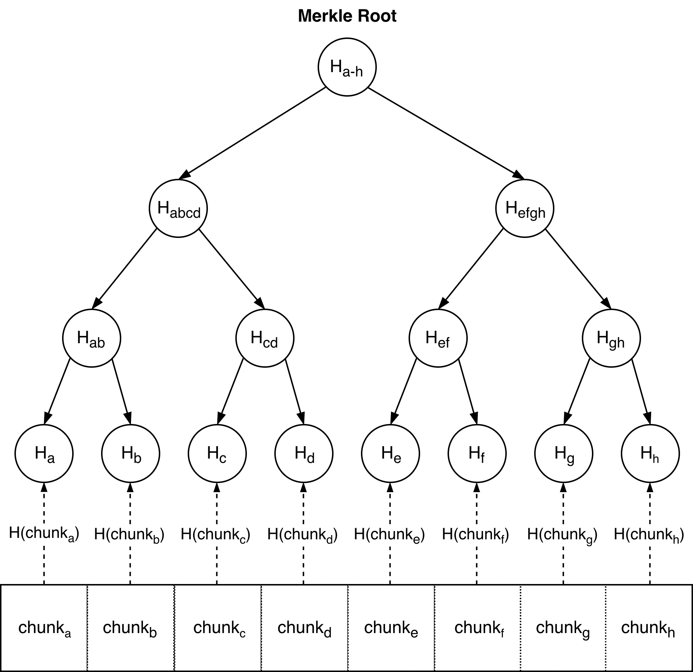
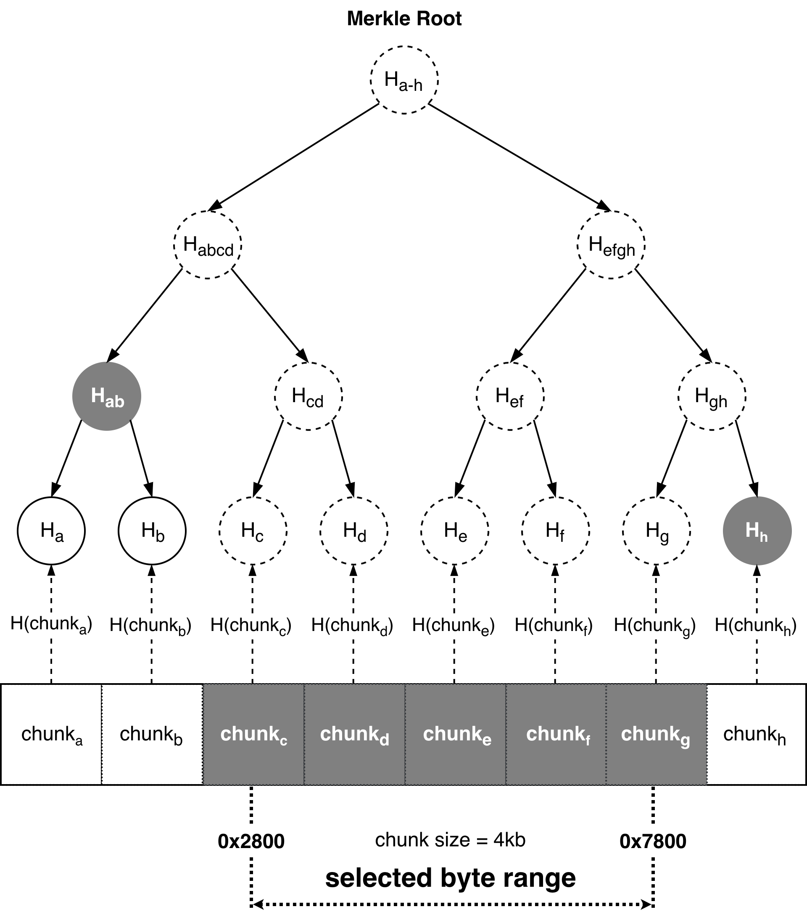
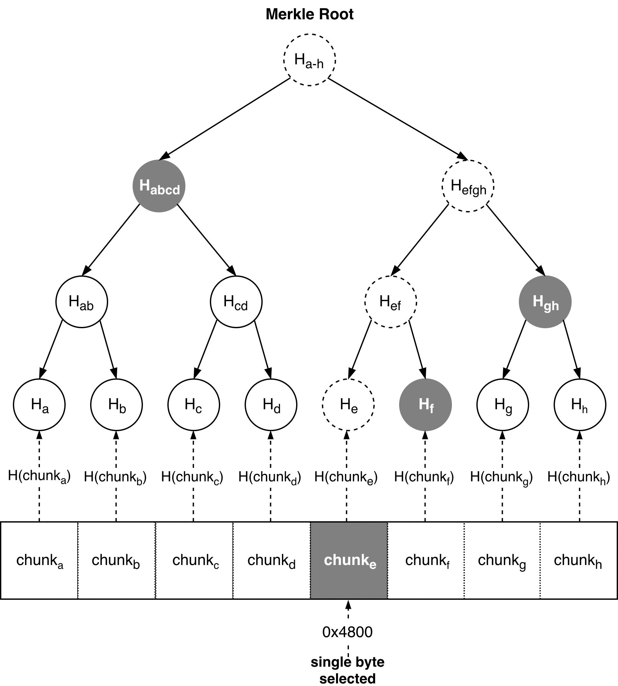

# Protocol

- [Preface](#preface)
- [Core](#core)
  - [Merkle Trees](#merkle-trees)
- [External systems](#external-systems)
  - [Ethereum](#ethereum)
  - [Swarm](#swarm)
- [Initial setup](#initial-setup)
- [Transactions](#transactions)
- [Sidechain](#sidechain)
- [Real-time processing](#real-time-processing)
  - [Transaction validation](#transaction-validation)
  - [Tendermint block formation](#tendermint-block-formation)
  - [Block processing](#block-processing)
  - [Query response](#query-response)
- [Client](#client)
  - [Query response verification](#query-response-verification)
    - [Prerequisites](#prerequisites)
    - [Verification of Swarm receipts](#verification-of-swarm-receipts)
    - [Verification of consensus on the virtual machine state](#verification-of-consensus-on-the-virtual-machine-state)
    - [Verification of Merkle proofs for returned VM state chunks](#verification-of-merkle-proofs-for-returned-vm-state-chunks)
- [Batch validation](#batch-validation)
  - [Transactions history downloading](#transactions-history-downloading)
  - [State snapshots](#state-snapshots)
  - [History replaying](#history-replaying)
  - [State hash mismatch resolution](#state-hash-mismatch-resolution)
  - [Validators selection](#validators-selection)

## Preface

This protocol specification describes one simple thing: how a (light) client interacting with the Fluence network will become convinced that whatever results the network has supplied to it in the real-time will be validated later on in the batch mode, and if any discrepancy found during the validation – that offending nodes will be penalized.

This document is not a replacement for a white paper or a design proposal; it doesn't discuss **why** certain things should work the way they are described, neither it specifies **how** things would work on the technical level. Most likely parts of it will get absorbed by the future white paper describing the Fluence network architecture or a more detailed specification allowing to independently implement a network node. 

However, at least for now this specification aims to accurately express **what** _conceptually_ happens in the network, and let developers have a single point of synchronization. We also hope it will give some intuition that the construction is secure – an intuition that is expected to be proven more formally in the future yellow paper.

## Core

Before we start describing the protocol, few words need to be said about the core building blocks. 

First of all, we use a simplified version of Go as a pseudocode to illustrate chosen algorithms. It should be noted that the reference Fluence network implementation doesn't use Go: in fact, it's mostly Scala, TypeScript and Rust. However, Go simplicity allows to use it to describe complex algorithms without too much boilerplate. Go is also statically typed, which allows to use a compiler to catch at least some mistakes. Source codes used in this specification can be found 
[here](./protocol).

We assume that few pretty simple library functions are available in this specification. `assertTrue` and `assertEq` will panic if the boolean or equality condition doesn't hold. `pack` and `packMulti` will serialize an input into the byte array or few byte array chunks.

```go
type Chunk = []byte

// panics if the condition is false
func assertTrue(condition bool) {}

// panics if the condition is false
func assertEq(x, y interface{}) {}

// serializes arguments to a byte array
func pack(args... interface{}) []byte {}

// serializes elements of a compound object (array or structure) into byte arrays
func packMulti(object interface{}) []Chunk {} 
```

Basic cryptographic primitives such as digital signature generation and verification, cryptographic hash computation and Merkle tree composition are listed below and used throughout the rest of the protocol specification. We do not specify exact algorithms such as SHA3, RIPEMD or EdDSA for those primitives but still assume them to behave according to the common expectations.

```go
type Digest     = [32]byte
type PublicKey  = [32]byte
type PrivateKey = [64]byte
type Signature  = [64]byte

type MerkleProof struct {
  Path     []int      // path from the Merkle tree root to the selected chunk
  Siblings [][]Digest // Merkle tree layer –> sibling index in the layer –> sibling (chunk hash)
}

type Seal struct {
  PublicKey PublicKey
  Signature Signature
}

// computes a cryptographic hash of the input data
func Hash(data []byte) Digest {}

// produces a digital signature for the input data digest
func Sign(publicKey PublicKey, privateKey PrivateKey, digest Digest) Seal {}

// verifies that the input data digest is signed correctly
func Verify(seal Seal, digest Digest) bool {}

// computes a Merkle root using supplied chunks as leaf data blocks in the Merkle tree
func MerkleRoot(allChunks []Chunk) Digest {}

// generates a Merkle proof for the chunk selected from the chunks list
func CreateMerkleProof(index int, selectedChunk Chunk, allChunks []Chunk) MerkleProof {}

// verifies that the Merkle proof of the selected chunk conforms to the Merkle root
func VerifyMerkleProof(selectedChunk Chunk, proof MerkleProof, root Digest) bool {}
```

### Merkle Trees
Merkle Trees and Merkle Proofs are used extensively in the protocol, so their description is mandatory. For a Merkle Tree to be built over a sequence of bytes, that sequence first splitted into chunks of the specified size.

```go
func Split(data []byte, chunk int32) []Chunk
```

For example, chunk size in Fluence Merkle Tree is
```go
const FlChunkSize int32 = 4000
```

Then, each chunk is hashed, hashes grouped in pairs and hashed too and so on until Merkle Root is generated. Resulting Merkle Tree could be depicted like this.

<p align="center">
  
</p>

Here we have a byte sequence splitted into 8 chunks. For `FlChunkSize` that would mean a 32 kilobyte sequence. Now, let's imagine we need a proof for bytes from `0x2800` to `0x7800`. It would span 5 chunks of `FlChunkSize` size, from 3rd (c) to 7th (g). So a Merkle Proof for chunks in `[2, 6]` (zero indexed) would look like this.

<p align="center">
  
</p>

Here, `Chunks` are the chunks `[2, 6]` themselves, and `Hashes` are <code>H<sub>ab</sub></code> and <code>H<sub>h</sub></code>. Every other hash required for checking the proof could be calculated either from `Chunks` or from `Hashes`.

In code, Merkle Proof is represented by
```go
type RangeMerkleProof struct {
	Chunks []Chunk
	Hashes [][]Digest
}
```

And can be generated by calling
```go
func FlRangeMerkleProof(data []byte, offset int32, length int32) RangeMerkleProof {
	var byteRange = ByteRange{
		Offset:    offset,
		Length:    length,
		ChunkSize: FlChunkSize,
	}
	return BuildRangeMerkleProof(data, byteRange, Hash)
}
```

`FlRangeMerkleProof` uses more general function
```go
func BuildRangeMerkleProof(data []byte, byteRange ByteRange, hashFn HashFunc) RangeMerkleProof {
	var chunks = Split(data, byteRange.ChunkSize)
	var startChunk = byteRange.StartChunk()
	var stopChunk = byteRange.StopChunk()

	var bottomChunks = chunks[startChunk:stopChunk]

	var tree = BuildMerkleTree(chunks, hashFn)
	var proof = RangeProof(tree, startChunk, stopChunk)

	return RangeMerkleProof{
		Chunks: bottomChunks,
		Hashes: proof,
	}
}
```

Proof generation logic is implemented by `RangeProof` function that first locates hashes of the left and right chunks in the Merkle Tree. Then it checks if left hash is the leftmost sibling, and if not, adds the sibling to the Merkle Proof. It does the same with the right hash: checks if it's the rightmost sibling and if it's not, adds rightmost sibling to the Merkle Proof. Then it goes to the parents of the hashes and does the same for them. The process repeats for all parents until root is reached.

```go
func RangeProof(tree MerkleTree, start int32, stop int32) [][]Digest
```

For a single byte range, algorithm effectively generates an ordinary Merkle Proof. For example, on 64 kilobyte sequence, a proof for a byte at `0x4800` would look like.

<p align="center">
  
</p>

## External systems

### Ethereum

For the purposes of this protocol specification, Ethereum is viewed as a secure state storage keeping few related smart contracts. For example, we can define a smart contract storing security deposits of the network participants.

```go
type ExampleContract struct {
  Deposits map[PublicKey]int64 // security deposits: node identifier –> deposit size
}
```

Such contract might have a method defined on it to be called by Ethereum clients. The difference between the method and an ordinary function is that a method would carry the contract as a receiver: `func (contract ExampleContract) foobar()`. In this protocol specification we pretend that the function defined as **a contract method is executed by the entire Ethereum network**. As a consequence, we can trust the changes it makes to the contract data.

```go
func (contract ExampleContract) MakeDeposit(size int64, seal Seal) {
  if Verify(seal, Hash(pack(size))) {
    // the deposit size is really signed with the node private key, updating the contract data
    contract.Deposits[seal.PublicKey] += size
  }
}
```

Any network participant can read the contract data to, for example, make sure that a certain node still has a security deposit placed. Note that while the function below also accepts a contract as an argument, _it is not a contract method_ and is executed by a single potentially malicious agent. We can't trust its results unless additional measures (such as BFT consensus) are used.

```go
func VerifyDeposit(contract ExampleContract, nodeId PublicKey, minDeposit int64) bool {
  return contract.Deposits[nodeId] >= minDeposit
}
```

### Swarm

In this specification we treat Swarm as a decentralized storage where a content can be accessed by its hash. Swarm has it's own set of cryptographic primitives which we don't expect to be compatible with Fluence core primitives.

```go
// listed Swarm functions carry the same meaning and arguments as core functions
func SwarmHash(data []byte) Digest {}
func SwarmSign(publicKey PublicKey, privateKey PrivateKey, digest Digest) Seal {}
func SwarmVerify(seal Seal, digest Digest) bool {}
```

We assume that every node serving in the Swarm network has an identifier and a public/private key pair and is registered in the Ethereum smart contract.

```go
type SwarmContract struct {
  Deposits map[PublicKey]int64 // security deposits: node identifier –> deposit size
}
```

We assume that Swarm provides an upload function which returns a Swarm receipt indicating Swarm network accountability for the passed content. The receipt contains the Swarm hash of the content and the signature of the Swarm node which is financially responsible for storing the content. Using the provided receipt, any Swarm client can download the content from the Swarm network.

Receipts functionality is not implemented yet in the current Swarm release, however it's described in details in the ["Swap, swear and swindle: incentive system for Swarm"](https://swarm-gateways.net/bzz:/theswarm.eth/ethersphere/orange-papers/1/sw^3.pdf) paper and can be reasonably expected to be rolled out some time soon.

```go
type SwarmReceipt struct {
  ContentHash Digest // Swarm hash of the stored content
  Insurance   Seal   // insurance written by the Swarm node for the accepted content
}

// uploads the content to the Swarm network, returns a receipt of responsibility
func SwarmUpload(content []byte) SwarmReceipt {}

// downloads the content from the Swarm network using the supplied receipt
func SwarmDownload(receipt SwarmReceipt) []byte {}
```

## Initial setup

There are few different actor types in the Fluence network: clients, real-time nodes forming Tendermint clusters and batch validators. Every node has an identifier, a public/private key pair and a security deposit, and is registered in the Fluence smart contract.

```go
type BasicFluenceContract struct {
  ClientDeposits     map[PublicKey]int64 // clients: identifier –> deposit size
  NodesDeposits      map[PublicKey]int64 // real-time nodes: identifier –> deposit size
  ValidatorsDeposits map[PublicKey]int64 // batch validators: identifier –> deposit size
}
```

## Transactions

A transaction always has a specific authoring client and carries all the information required to execute a deployed WebAssembly function:

```go
type Transaction struct {
  Invoke []byte // function name & arguments + required metadata
  Seal   Seal   // client signature
}

type Transactions = []Transaction
```

## Sidechain

For this protocol we need some kind of a sidechain that would periodically checkpoint selected blocks to the root chain – Ethereum. Blocks stored in this sidechain are really tiny compared to the overall data volumes flowing through the network. Normally they contain only receipts of the data stored in Swarm and producers signatures.

<p align="center">
  
</p>

Fluence smart contract stores checkpoints and allows to locate specific ones by history or by the block height.

```go
type SideBlock struct {
  Height        int64        // side block height
  PrevBlockHash Digest       // hash of the previous side block
  Receipt       SwarmReceipt // Swarm receipt for the content associated with the side block
  Signatures    []Seal       // signatures of the side block producers
}

type SideFluenceContract struct {
  base                  BasicFluenceContract // parent contract
  SideNodesDeposits     map[PublicKey]int64  // sidechain nodes: identifier –> deposit size
  
  CheckpointInterval    int64                // how often blocks should be checkpointed
  Checkpoints           []SideBlock          // block checkpoints
  CheckpointsByHeight   map[int64]SideBlock  // block height –> block
  CheckpointsSignatures map[int64][]Seal     // block height –> sidechain nodes signatures
}
```

It is expected that every sidechain node stores the tail of the chain starting from the last block checkpointed into the contract. Every node verifies there are no forks or incorrect references in the stored chain tail – otherwise, a dispute is submitted to the contract and offending block producers lose their deposits.

```go
// punishes block producers if blocks are not linked correctly
func (contract SideFluenceContract) DisputeReference(block SideBlock, nextBlock SideBlock) {
  if nextBlock.PrevBlockHash != Hash(pack(block)) && nextBlock.Height == block.Height+1 {
    
    // violation! let's punish producers signed the next block!
    for _, seal := range nextBlock.Signatures {
      contract.base.NodesDeposits[seal.PublicKey] = 0
    }
  }
}

// punishes block producers if a fork is present
func (contract SideFluenceContract) DisputeFork(block1 SideBlock, block2 SideBlock) {
  if block1.PrevBlockHash == block2.PrevBlockHash {
    
    // violation! let's punish producers signed both blocks!
    var m = make(map[PublicKey]bool)
    for _, seal := range block1.Signatures {
      m[seal.PublicKey] = true
    }
    
    for _, seal := range block2.Signatures {
      if m[seal.PublicKey] {
        contract.base.NodesDeposits[seal.PublicKey] = 0
      }
    }
  }
}
```

Every sidechain node also verifies that a checkpointing was performed correctly – i.e. there is a correct block being uploaded to the contract every period of time. Otherwise, another dispute is submitted to the contract, but this time a sidechain node that has uploaded an incorrect checkpoint block will lose a deposit.

```go
// punishes sidechain nodes if the block is checkpointed incorrectly
func (contract SideFluenceContract) DisputeCheckpoint(index int, blocks []SideBlock) {
  var prevCheckpoint = contract.Checkpoints[index-1]
  var checkpoint = contract.Checkpoints[index]

  // checking that the chain is linked correctly
  for i, block := range blocks {
    var prevBlock SideBlock
    if i == 0 {
      prevBlock = prevCheckpoint
    } else {
      prevBlock = blocks[i-1]
    }
    if block.PrevBlockHash != Hash(pack(prevBlock)) || (block.Height != prevBlock.Height+1) {
      // incorrect subchain, nothing to do here
      return
    }
  }

  if Hash(pack(blocks[len(blocks)-1])) != Hash(pack(checkpoint)) {
    // violation! let's punish sidechain nodes uploaded the checkpoint!
    for _, seal := range contract.CheckpointsSignatures[checkpoint.Height] {
      contract.SideNodesDeposits[seal.PublicKey] = 0
    }
  }
}
```

Every sidechain node allows producers to upload a new block to it and returns a signature if the block was accepted. Honest sidechain nodes would accept the block if and only if it doesn't violate an integrity of the sidechain tail.

```go
type SideNode struct {
  Tail []SideBlock
}

// appends the block to the chain tail and checks it doesn't violate correctness properties
func (node SideNode) UploadBlock(block SideBlock) Seal {}
```

Honest sidechain nodes will eventually checkpoint stored blocks to the smart contract and submit a dispute to Ethereum shall they notice any violation. This means a client needs only few signatures of the relevant sidechain nodes to have a confidence that the block that was uploaded to the sidechain is the correct one and won't be lost.

## Real-time processing

### Transaction validation

Once the client has constructed a transaction, it is submitted to one of the real-time nodes which checks the received transaction:

```go
// verifies that a transaction was originated by the client with enough funds deposited
func VerifyTransaction(contract BasicFluenceContract, tx Transaction, minDeposit int64){
  // checking that the client actually exists in the contract
  var deposit, ok = contract.ClientDeposits[tx.Seal.PublicKey]
  assertTrue(ok)

  // checking that the client has enough funds
  assertTrue(deposit >= minDeposit)

  // checking that the transaction was signed by this client
  assertTrue(Verify(tx.Seal, Hash(tx.Invoke)))
}
```

If the transaction passes the check, it's added to the mempool and might be later used in forming a block, otherwise the transaction is declined. While the transaction _might_ be used in a block, the node doesn't (and in fact, is unable to if the rest of the cluster is malicious) provide any guarantees it will be included into the block or processed by the cluster.


### Tendermint block formation

Tendermint consensus engine produces new blocks filled with the client supplied transactions and feeds them to the Fluence state machine.

```go
type Block struct {
  Header     Header       // block header
  LastCommit []Seal       // Tendermint nodes votes for the previous block
  Txs        Transactions // transactions as sent by clients
}

type Header struct {
  LastBlockHash  Digest // Merkle root of the previous block header fields
  LastCommitHash Digest // Merkle root of the last commit votes
  TxsHash        Digest // Merkle root of the block transactions
  AppHash        Digest // application state hash after the previous block
}
```

Tendermint uses Merkle trees to compute the Merkle root of certain pieces of data and digital signatures to sign produced blocks, however here we assume these functions are not necessary compatible with Fluence and denote them separately.

```go
// listed Tendermint functions carry the same meaning and arguments as core functions
func TmSign(publicKey PublicKey, privateKey PrivateKey, digest Digest) Seal {}
func TmVerify(seal Seal, digest Digest) bool {}
func TmMerkleRoot(chunks []Chunk) Digest {}
```

Tendermint periodically pulls few transactions from the mempool and forms a new block. Nodes participating in consensus sign produced blocks, however their signatures for a specific block are available only as a part of the next block.

```go
// Tendermint real-time node
type RealtimeNode struct {
  PublicKey  PublicKey
  privateKey PrivateKey
}

// signs the block assuming the node has voted for it during consensus settlement
func (node RealtimeNode) SignBlockHash(blockHash Digest) Seal {
  return TmSign(node.PublicKey, node.privateKey, blockHash)
}

// prepares the block (assuming the nodes have reached a consensus)
func PrepareBlock(nodes []RealtimeNode, prevBlock Block, txs Transactions, appHash Digest) Block {
  var lastBlockHash = TmMerkleRoot(packMulti(prevBlock.Header))
  var lastCommit = make([]Seal, 0, len(nodes))
  for i, node := range nodes {
    lastCommit[i] = node.SignBlockHash(lastBlockHash)
  }

  return Block{
    Header: Header{
      LastBlockHash:  lastBlockHash,
      LastCommitHash: TmMerkleRoot(packMulti(lastCommit)),
      TxsHash:        TmMerkleRoot(packMulti(txs)),
      AppHash:        appHash,
    },
    LastCommit: lastCommit,
    Txs:        txs,
  }
}
```

Note we haven't specified here how the application state hash (`Block.Header.AppHash`) is getting calculated – this will be described in the next section.

### Block processing

Once the block has passed through Tendermint consensus, it is delivered to the state machine. State machine passes block transactions to the WebAssembly VM causing the latter to change state. The virtual machine state is essentially a block of memory split into chunks which can be used to compute the virtual machine state hash. We can say that the virtual machine state `k + 1` is derived by applying transactions in the block `k` to the virtual machine state `k`.

```go
type VMState struct {
  Chunks []Chunk // virtual machine memory chunks
}

// produces the new state by applying block transactions to the old VM state
func NextVMState(vmState VMState, txs Transactions) VMState {}
```

Once the block is processed by the WebAssembly VM, it has to be stored in Swarm for the future batch validation. Two separate pieces are actually stored in Swarm for each Tendermint block: the block manifest and the transactions list.

```go
type Manifest struct {
  Header              Header       // block header
  VMStateHash         Digest       // hash of the VM state derived by applying the block
  LastCommit          []Seal       // Tendermint nodes signatures for the previous block header
  TxsReceipt          SwarmReceipt // Swarm hash of the block transactions
  LastManifestReceipt SwarmReceipt // Swarm hash of the previous manifest
}
```

 Every manifest contains the Swarm hash of the transactions list, which makes it possible to find transactions by having just the manifest. Every manifest also contains the Swarm hash of the previous manifest which allows to retrieve the entire history by having just a single Swarm receipt for the latest manifest.

<p align="center">
  
</p>

To create a manifest, the node splits the block into pieces, computes the hash of the new virtual machine state, uploads transactions to Swarm and adds links to the necessary Swarm content. Also, once the block manifest is crafted, it's hash is used as the new application state hash stored in the next block header. This way, because Tendermint nodes that have reached consensus sign the block header, they also confirm that the new manifest and the new virtual machine state were accepted.

```go
// returns the new virtual machine state, the manifest for the stored block and the next app hash
func ProcessBlock(block Block, prevVMState VMState, prevManifestReceipt SwarmReceipt,
) (VMState, Manifest, SwarmReceipt, Digest) {
  var vmState = NextVMState(prevVMState, block.Txs)
  var txsReceipt = SwarmUpload(pack(block.Txs))

  var manifest = Manifest{
    Header:              block.Header,
    VMStateHash:         MerkleRoot(vmState.Chunks),
    LastCommit:          block.LastCommit,
    TxsReceipt:          txsReceipt,
    LastManifestReceipt: prevManifestReceipt,
  }
  var receipt = SwarmUpload(pack(manifest))
  var nextAppHash = Hash(pack(manifest))

  return vmState, manifest, receipt, nextAppHash
}
```

### Query response

Once the cluster has reached consensus on the block, advanced the virtual machine state, reached consensus on the next couple of blocks and saved related block manifests and transactions into Swarm, the client can query results of the function invocation through the ABCI query API. 

Let's assume the transaction sent by the client was included into the block `k`. In this case the client has to wait until the block `k + 2` is formed and block manifests for the corresponding three blocks are uploaded to Swarm. Once this is done, the response returned to the client will look the following:

```go
type QueryResponse struct {
  Chunks    map[int]Chunk       // selected virtual machine state chunks
  Proofs    map[int]MerkleProof // Merkle proofs: chunks belong to the virtual machine state
  Manifests [3]Manifest         // block manifests
}
```

Results obtained by invoking the function are stored as a part of the virtual machine state. This way, the node can return selected chunks of the virtual machine memory and supply Merkle proofs confirming these chunks indeed correspond to the correct virtual machine state Merkle root.

```go
// prepares the query response
func MakeQueryResponse(manifests [3]Manifest, vmState VMState, chunksIndices []int) QueryResponse {
  var chunks = make(map[int]Chunk)
  var proofs = make(map[int]MerkleProof)

  for _, index := range chunksIndices {
    var chunk = vmState.Chunks[index]

    chunks[index] = chunk
    proofs[index] = CreateMerkleProof(index, chunk, vmState.Chunks)
  }

  return QueryResponse{Chunks: chunks, Proofs: proofs, Manifests: manifests}
}
```

The reason why do we need multiple manifests in response is that nodes are required to prove that a consensus was reached on the manifest `k`. `AppHash` in the manifest `k + 1` header points to the manifest `k` content, and `LastBlockHash` in the manifest `k + 2` header points to the manifest `k + 1` header. Also, `LastCommit` field in the manifest `k + 2` provides nodes signatures for the `LastBlockHash`. A client can follow those links and verify the consistency of obtained results.

<p align="center">
  
</p>

## Client

### Query response verification

The client verifies that returned response represents a correct block progress in a few steps. Below we will list those steps, but first we need to mention that they are not verifying that the transaction sent by the client was actually processed.

Instead, all the client does verify here is that the virtual machine state progress made by executing the block `k` was saved properly in Swarm for the future batch validation. In this case, if the state transition was performed incorrectly, real-time nodes deposits will be slashed.

However, an all-malicious cluster might never include the transaction sent by the client. In this case the new virtual machine state won't have the corresponding function return value. It might also happen that a malicious cluster will include an invalid transaction into the block. For example, that might be a transaction that was never originated by the correct client but still changing the state.

These aspects will be considered in another section, and for now we will focus on how the block progress is being verified.

**[???]** Do we need to supply the SwarmReceipt for the last manifest?  
**[TODO]** We should describe how these manifests are stored/verified using the sidechain.

#### Prerequisites

Below we assume that functions allowing to verify that Swarm receipts and Tendermint signatures were created by valid nodes already exist.

```go
func VerifySwarmReceipt(contract SwarmContract, receipt SwarmReceipt) {
  var minDeposit int64 = 1000000

  // checking that the Swarm node has enough funds
  var swarmNodeId = receipt.Insurance.PublicKey
  assertTrue(contract.Deposits[swarmNodeId] >= minDeposit)

  // checking that the receipt is signed by this Swarm node
  assertTrue(SwarmVerify(receipt.Insurance, receipt.ContentHash))
}

func VerifyTendermintSignature(contract BasicFluenceContract, seal Seal, blockHash Digest) {
  var minDeposit int64 = 1000000

  // checking that the Tendermint node has enough funds
  var RealtimeNodeId = seal.PublicKey
  assertTrue(contract.NodesDeposits[RealtimeNodeId] >= minDeposit)

  // checking that the receipt is signed by this Tendermint node
  assertTrue(TmVerify(seal, blockHash))
}
```

#### Verification of Swarm receipts

The client checks that every manifest is stored in Swarm properly. This means that each Swarm receipt – issued for the previous manifest or for the transactions block is signed by the Swarm node in good standing. It also means that manifests are connected together properly by Swarm receipts.

```go
func VerifyManifestsReceipts(contract SwarmContract, response QueryResponse) {
  // checking that manifests and transactions receipts are properly signed by Swarm nodes
  for _, manifest := range response.Manifests {
    VerifySwarmReceipt(contract, manifest.LastManifestReceipt)
    VerifySwarmReceipt(contract, manifest.TxsReceipt)
  }

  // checking that each manifest points correctly to the previous manifest via the Swarm receipt
  for i := 0; i < 2; i++ {
    var manifest = response.Manifests[i + 1]
    var prevManifest = response.Manifests[i]

    assertEq(manifest.LastManifestReceipt.ContentHash, SwarmHash(pack(prevManifest)))
  }
}
```

#### Verification of consensus on the virtual machine state

The client checks that the chain linking Tendermint nodes signatures in the manifest `k + 2` with the virtual machine state hash in the manifest `k` is formed correctly. It also checks that the BFT consensus was reached by Tendermint nodes in good standing.

```go
// verifies a BFT consensus was reached on the manifest, returns nodes signed it
func VerifyVMStateConsensus(contract BasicFluenceContract, manifests [3]Manifest) []PublicKey {
  // checking connection between the VM state in the manifest 0 and Tendermint signatures in the manifest 2
  assertEq(manifests[1].Header.AppHash, Hash(pack(manifests[0])))
  assertEq(manifests[2].Header.LastBlockHash, TmMerkleRoot(packMulti(manifests[1].Header)))

  // counting the number of unique Tendermint nodes public keys
  var lastCommitPublicKeys = make(map[PublicKey]bool)
  for _, seal := range manifests[2].LastCommit {
    lastCommitPublicKeys[seal.PublicKey] = true
  }

  // checking that BFT consensus was actually reached
  var signedNodes = float64(len(lastCommitPublicKeys))
  var requiredNodes = float64(2/3) * float64(len(contract.NodesDeposits))
  assertTrue(signedNodes > requiredNodes)

  // checking each Tendermint node signature validity
  for _, seal := range manifests[2].LastCommit {
    VerifyTendermintSignature(contract, seal, manifests[2].Header.LastBlockHash)
  }

  return keys(lastCommitPublicKeys).([]PublicKey)
}
```

#### Verification of Merkle proofs for returned VM state chunks

Finally, the client checks that returned virtual machine state chunks indeed belong to the virtual machine state hash.

```go
func VerifyResponseChunks(results QueryResponse) {
  for k := range results.Chunks {
    assertTrue(VerifyMerkleProof(results.Chunks[k], results.Proofs[k], results.Manifests[0].VMStateHash))
  }
}
```

## Batch validation

### Transactions history downloading

Batch validators are able to locate the blocks that should be checked using the checkpoints stored in the Ethereum contract. The validator chooses one of the checkpoints and downloads the manifest complementary to it using the suitable Swarm receipt. Now, the validator can unwind the chain until the next checkpoint by following receipts stored in each manifest and also download corresponding transactions.

```go
type BatchValidator struct {
  PublicKey  PublicKey
  privateKey PrivateKey
}

type Subchain struct {
  Manifests    []Manifest
  Transactions []Transactions
}

// fetches the subchain by tracing back starting from the checkpoint with the specified block height
func (validator BatchValidator) FetchSubchain(contract SideFluenceContract, height int64) Subchain {
  var checkpoint = contract.CheckpointsByHeight[height]

  var count = contract.CheckpointInterval + 2
  var manifests = make([]Manifest, count)
  var txss = make([]Transactions, count)

  var receipt = checkpoint.Receipt
  for i := count - 1; i >= 0; i-- {
    manifests[i] = ManifestUnpack(SwarmDownload(receipt))
    txss[i] = TransactionsUnpack(SwarmDownload(manifests[i].TxsReceipt))

    receipt = manifests[i].LastManifestReceipt
  }

  return Subchain{Manifests: manifests, Transactions: txss}
}
```

Here you can note that the number of manifests fetched exceeds the checkpoint interval by two. The reason is that, as we have mentioned in [§ Query response](#query-response) the block `k + 2` certifies the consensus on the block `k` virtual machine state. This means that checkpoint intervals and batch validation intervals are actually offset by two blocks.

<p align="center">
  
</p>

### State snapshots

Once the validator has downloaded required manifests and transactions, it applies them to the previous virtual machine state snapshot. Snapshots are also stored in Swarm – one snapshot per each checkpoint interval, and their Swarm receipts are stored in the smart contract.

```go
type ValidationFluenceContract struct {
  Confirmations map[int64]Confirmation // confirmations: block height –> confirmation
}

type Confirmation struct {
  SnapshotMeta SnapshotMeta // virtual machine state metadata
  Endorsements []Seal       // batch validators signatures certifying snapshot correctness
}

type SnapshotMeta struct {
  SnapshotReceipt SwarmReceipt // Swarm receipt for the virtual machine state snapshot
  VMStateHash     Digest       // virtual machine state hash
}

// initializes snapshot metadata and links the associated batch validation endorsement
func (contract ValidationFluenceContract) EndorseInit(height int64, seal Seal, meta SnapshotMeta) {}

// adds batch validator's endorsement to the confirmations list
func (contract ValidationFluenceContract) Endorse(height int64, seal Seal) {}
```

Because, as we have already mentioned, it takes two blocks to certify the consensus, snapshots are also shifted relative to checkpoints: for the checkpoint manifest `k`, the snapshot would represent the virtual machine state after processing blocks from `0` to `k – 2` included.

<p align="center">
  
</p>

The validation contract carries endorsements of the snapshot by batch validators. Once the batch validator has produced a new virtual machine state, it uploads the snapshot to Swarm (unless there is already a snapshot uploaded) and submits an endorsement to the smart contract. Of course, this happens only if there were no disputes during the processing of blocks.

```go
// uploads the VM state to Swarm if needed and endorses it in the validation smart contract
func (validator BatchValidator) Endorse(contract ValidationFluenceContract, height int64, state VMState) {
  var swarmHash = SwarmHash(pack(state.Chunks))
  var vmStateHash = MerkleRoot(state.Chunks)

  var seal = Sign(validator.PublicKey, validator.privateKey, Hash(pack(swarmHash, vmStateHash)))

  _, exists := contract.Confirmations[height]
  if exists {
    // no need to upload the virtual machine snapshot to Swarm
    contract.Endorse(height, seal)
  } else {
    // uploading the state to Swarm
    var receipt = SwarmUpload(pack(state.Chunks))

    var meta = SnapshotMeta{SnapshotReceipt: receipt, VMStateHash: vmStateHash}
    contract.EndorseInit(height, seal, meta)
  }
}
```

### History replaying

To produce a new virtual machine state snapshot, a batch validator downloads the previous snapshot and applies transactions happened since it was created. This is done with the help of the snapshot loading routine which also verifies snapshot correctness. Note that the state snapshot endorsement is actually written for two different state hashes: the Swarm-specific one (`SnapshotMeta.SnapshotReceipt.ContentHash`) and the one belonging to the Fluence core (`SnapshotMeta.VMStateHash`).

Both hashes are computed in a similar fashion – as a Merkle root of the supplied content, however they might use different cryptographic hash functions. Chunk sizes might also be different, however that makes the narrative below a bit more involved and will be expanded in future versions of this document.

It's expected, however, that both hashes match the content actually stored in Swarm. While for Swarm hash that's guaranteed by Swarm insurance, it might not be the case for the virtual machine state hash. For now we assume that the snapshot loading routine verifies the snapshot correctness and will discuss later on how a batch validator can protest if a discrepancy is found.

```go
// returns the downloaded state and it's correctness status
func (validator BatchValidator) LoadSnapshot(contract ValidationFluenceContract, height int64) (VMState, bool) {
  var confirmation = contract.Confirmations[height]
  var meta = confirmation.SnapshotMeta

  var state = VMStateUnpack(SwarmDownload(meta.SnapshotReceipt))
  var correct = meta.VMStateHash == MerkleRoot(state.Chunks)
  
  return state, correct
}
```

To produce the state for the checkpoint `k + t` where `t` is the checkpoint interval, the batch validator has to download from Swarm the state snapshot for the checkpoint `k` (this snapshot will have an index `k – 2`) and apply to it blocks `[k – 1, ..., k + t – 2]`.

<p align="center">
  
</p>

For each block the batch validator verifies that BFT consensus was reached by the real-time Tendermint cluster. This is done the same way as the [client-side verification](#verification-of-consensus-on-the-virtual-machine-state) and allows to identify the nodes responsible for the state progress made.

```go
// verifies a BFT consensus was reached on the manifest, returns nodes signed it
func VerifyVMStateConsensus(contract BasicFluenceContract, manifests [3]Manifest) []PublicKey {}
```

The batch validator applies blocks one by one to the snapshot and computes the virtual machine state hash after each block application. If the calculated hash doesn't match the hash stored in the manifest, either the batch validator or the real-time cluster has performed an incorrect state advance. This condition should be resolved via the verification game which is described later in this document.

Otherwise, if there were no disagreements while processing the history the batch validator has obtained a new state snapshot which will have an index `k + t – 2`. The batch validator uploads this snapshot to Swarm and updates the validation smart contract with an endorsement record.

```go
func (validator BatchValidator) Validate(
    basicContract BasicFluenceContract,
    sideContract SideFluenceContract,
    validationContract ValidationFluenceContract,
    height int64,
) {
  // fetching transactions and the previous snapshot
  var subchain = validator.FetchSubchain(sideContract, height)
  var snapshot, ok = validator.LoadSnapshot(validationContract, height - sideContract.CheckpointInterval)

  if ok {
    for i := 0; i < len(subchain.Manifests) - 2; i++ {
      // verifying BFT consensus
      var window = [3]Manifest{}
      copy(subchain.Manifests[i:i+2], window[0:3])
      var publicKeys = VerifyVMStateConsensus(basicContract, window)

      // verifying the real-time cluster state progress correctness
      snapshot = NextVMState(snapshot, subchain.Transactions[i])
      var vmStateHash = MerkleRoot(snapshot.Chunks)
      if vmStateHash != subchain.Manifests[i].VMStateHash {
        // TODO: dispute state advance using publicKeys, stop processing
        _ = publicKeys
      }
    }

    // uploading the snapshot and sending a signature to the smart contract
    validator.Endorse(validationContract, height, snapshot)
  } else {
    // TODO: dispute snapshot incorrectness
  }
}
```

**FIXME:** the state snapshot hash should match the checkpoint hash which is impossible now because they are actually off by 2.

### State hash mismatch resolution

It might happen that a malicious batch validator **M** has generated the snapshot **state<sub>k</sub><sup>M</sup>** and uploaded it to Swarm. Now the snapshot should be accessible by the Swarm hash **swHash<sub>k</sub><sup>M</sup>**. We also assume that **M** has also submitted to the smart contract an incorrect virtual machine hash **vmHash<sub>k</sub><sup>M</sup>**. In this case, we have the following situation: **swHash<sub>k</sub><sup>M</sup>** == _SwarmHash_(**state<sub>k</sub><sup>M</sup>**), but **vmHash<sub>k</sub><sup>M</sup>** != _MerkleRoot_(**state<sub>k</sub><sup>M</sup>**).

Honest batch validator **A** is able to discover this after downloading the state snapshot `k` from Swarm using **swHash<sub>k</sub><sup>M</sup>** stored in the smart contract.

That's an exceptional situation which warrants a dispute resolution through Ethereum. Let's assume as an induction hypothesis that the snapshot **state<sub>k – t</sub>** and corresponding hashes were produced correctly, i.e. **swHash<sub>k – t</sub>** == _SwarmHash_(**state<sub>k – t</sub>**) and **vmHash<sub>k – t</sub>** == _MerkleRoot_(**state<sub>k – t</sub>**). Otherwise, the batch validator **A** can make another step back and attempt to submit a dispute for the snapshot **state<sub>k – t</sub>**. 

Given that the snapshot **state<sub>k – t</sub>** is valid, **A** applies a segment of transactions history to it and derives the snapshot **state<sub>k</sub><sup>A</sup>**. From this snapshot **A** derives hashes **swHash<sub>k</sub><sup>A</sup>** and **vmHash<sub>k</sub><sup>A</sup>**.

Now, two options are possible:

1) **vmHash<sub>k</sub><sup>A</sup>** != **vmHash<sub>k</sub><sup>M</sup>**

   This means **M** has performed an incorrect state advance which grounds for a verification game between **A** and **M**. This will be described later, but what's important is that we don't care about the original **vmHash<sub>k</sub><sup>M</sup>** != _MerkleRoot_(**state<sub>k</sub><sup>M</sup>**) hash mismatch anymore.

2) **vmHash<sub>k</sub><sup>A</sup>** == **vmHash<sub>k</sub><sup>M</sup>**
   
   Because **vmHash<sub>k</sub><sup>A</sup>** == _MerkleRoot_(**state<sub>k</sub><sup>A</sup>**) and **vmHash<sub>k</sub><sup>M</sup>** != _MerkleRoot_(**state<sub>k</sub><sup>M</sup>**), we can conclude that snapshots generated by **A** and **M** do not match: **state<sub>k</sub><sup>A</sup>** != **state<sub>k</sub><sup>M</sup>**.

   It's obvious that for any chunk index **i** in the state snapshot, **A** can generate a Merkle proof proving this chunk data **state[i]<sub>k</sub><sup>A</sup>** corresponds to the Merkle root **vmHash<sub>k</sub><sup>A</sup>** == _MerkleRoot_(**state<sub>k</sub><sup>A</sup>**) and at the same time another Merkle proof that it corresponds to the Merkle root **swHash<sub>k</sub><sup>A</sup>** == _SwarmHash_(**state<sub>k</sub><sup>A</sup>**). 

   However, by our assumption the Merkle root **vmHash<sub>k</sub><sup>M</sup>** == **vmHash<sub>k</sub><sup>A</sup>** == _MerkleRoot_(**state<sub>k</sub><sup>A</sup>**), but the Merkle root **swHash<sub>k</sub><sup>M</sup>** == _SwarmHash_(**state<sub>k</sub><sup>M</sup>**) where **state<sub>k</sub><sup>A</sup>** != **state<sub>k</sub><sup>M</sup>**. Basically, this means that **M** has generated **vmHash** and **swHash** using two different state snapshots.

   Now, all **A** needs to do is to find a chunk index **p** which points to the mismatched content in computed states: **state[p]<sub>k</sub><sup>A</sup>** != **state[p]<sub>k</sub><sup>M</sup>**, and submit a dispute to Ethereum smart contract requesting **M** to provide chunk **p** data and Merkle proofs proving its belonging to **vmHash<sub>k</sub><sup>M</sup>** and **swHash<sub>k</sub><sup>M</sup>**.

   Because those hashes were produced from different snapshots in the first place, **M** will not be able to do that. If the contract finds one of two proofs invalid or **M** times out, **M** is considered as the side which has lost the dispute and will have it's deposit slashed.

```go
// opens a new snapshot hash mismatch dispute
func (contract ValidationFluenceContract) OpenSnapshotDispute(height int64, chunkIndex int) SnapshotDispute {
  return SnapshotDispute{
    SnapshotMeta: contract.Confirmations[height].SnapshotMeta,
    ChunkIndex:   chunkIndex,
  }
}

type SnapshotDispute struct {
  SnapshotMeta SnapshotMeta
  ChunkIndex int
}

// returns whether the supplied Merkle proofs have passed an audite
func (dispute SnapshotDispute) Audit(chunk Chunk, vmProof MerkleProof, swarmProof MerkleProof) bool {
  // TODO: check chunk index in the proof
  // TODO: use Swarm-based Merkle proof verification

  return VerifyMerkleProof(chunk, vmProof, dispute.SnapshotMeta.VMStateHash) &&
      VerifyMerkleProof(chunk, swarmProof, dispute.SnapshotMeta.SnapshotReceipt.ContentHash)
}
```

### Validators selection

Only a fraction of the network is allowed to serve as batch validators for a particular checkpoint interval. This is done to avoid a situation when a subset of malicious batch validators produces invalid results for the entire history of a certain cluster.

**TODO**


