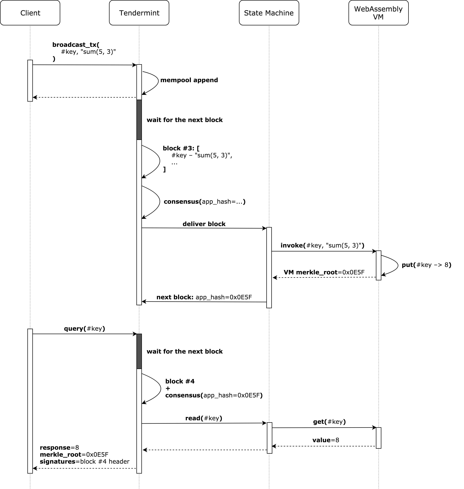
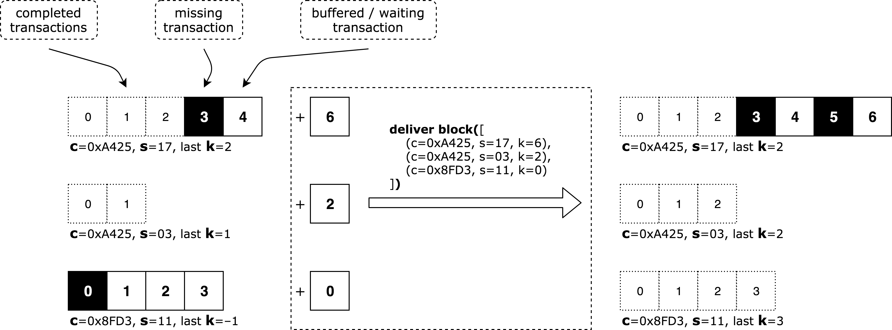

# Real-time computations

## Overview

### Real-time clusters

The _real-time component_ is the first out of two major data processing components in the network, and is also the only component a client directly interacts with. It consists of a bunch of modestly sized real-time clusters (expected typical size `4-16` nodes). Every node in the cluster runs the same WebAssembly code and stores the same data, while across different clusters the code and stored data generally differ.

A WebAssembly backend developer can designate certain functions as _entry points_, which means they are exposed through an API and can be invoked by a client. The real-time cluster takes care of marshaling and validating requests, leaving the developer only the task to properly implement the backend domain logic.

Every request that performs an entry point invocation is replicated across the nodes in the cluster. Each node applies it to the internal state and tries to reach (_BFT_) consensus with other nodes how the state should advance. This way the state is kept in sync across the nodes in the cluster. Every node that accepted the state change bears the full responsibility if it turns out the state change was incorrect. If the node doesn't agree with the state change, it's free to raise a _dispute_ right away.

Real-time clusters have a _data locality_ property: all the data required to perform the computation is stored locally on each node. This means real-time processing avoids network delays associated with identifying which chunk of data to fetch and then transferring it over the network. It's worth mentioning that replicating requests across the cluster or achieving consensus on the state change is also affected by network delays. However, this can be done in batch mode and doesn't affect latencies that much compared to non-trivial data processing.

### Surrounding ecosystem

Real-time clusters composition is supposed to be stable and not change much over time. Before joining the cluster, each node places a security deposit with the corresponding Ethereum smart contract. The deposit is released to a node only after passing of a cooling-off period during which the correctness of node's operations may be disputed. Relative stability of real-time clusters means there will be less expensive state resynchronizations which happen when nodes join or leave. 

However, this also means nodes in the cluster might eventually form a cartel producing incorrect computational results. Batch validation by independent randomly selected nodes outside of the cluster is designated to prevent this. To make it possible, real-time nodes store the history of incoming requests and state changes in the _decentralized deep storage_ – [Swarm](https://swarm-guide.readthedocs.io). This history might be used by batch validators to inspect state transitions, but also – to restore the real-time cluster shall any of the nodes go down.

### Client interactions

A client might interact with a real-time cluster through a predefined protocol. In general, the client is expected to be as light as possible and not store any data or domain logic code. To reason about security guarantees, the client normally performs the following (incomplete) list of checks:
- nodes participating in consensus and their security deposits in Ethereum smart contract
- the status of consensus over the state change and disputes presence
- whether the history of requests was properly updated in Swarm
- batch validation lag: how many requests the batch validation is behind the real-time

## API

From the client point of view the real-time cluster API is fairly simple. Let's imagine that a WebAssembly backend developer has deployed the WASM code, for example the one compiled from this Rust snippet:

```rust
static mut AMOUNT: u32 = 0;
static mut MAXIMUM: f64 = 0.0;

// #[no_mangle] directive tells the compiler to avoid changing the method name

#[no_mangle]
pub unsafe fn set_amount(amount: u32) {
  AMOUNT = amount;
}

#[no_mangle]
pub unsafe fn get_amount() -> u32 {
  AMOUNT
}

#[no_mangle]
pub unsafe fn update_maximum(value: f64) -> f64 {
  if value > MAXIMUM {
    MAXIMUM = value;
  }
  MAXIMUM  
}

#[no_mangle]
pub fn sum(x: u32, y: u32) -> u32 {
  x + y
}
```

Let's consider how the client could call those functions and receive the results. Assuming the client already has a connection to the real-time cluster, the first thing the client has to do is to create a new session:

```javascript
var fluence = ...
var session = fluence.newSession();
```

Once the session is initialized, it can be used to invoke various functions:

```javascript

session.invoke("set_amount", [50]);
session.invoke("set_amount", [10]);
session.invoke("set_amount", [35]);
var c = await session.invoke("get_amount");              // c == 35

session.invoke("update_maximum", [10.2]);
session.invoke("update_maximum", [75.0]);
var m = await session.invoke("update_maximum", [50.5]);  // m == 75.0

var s = await session.invoke("sum", [5, 3]);             // s == 8
```

In this example we can observe _effectful_ functions modifying the global state, functions returning some value which is a part of the global state, functions modifying the global state and returning some value and finally, _pure_ functions like `sum` that are deterministic and not accessing the global state at all.

Sometimes the client might want to invoke the function only for its _side effects_ – that's what we see when the client invokes the `set_amount` function. In this case, there is no need to use `await` to retrieve results. Moreover, the absence of awaiting for results allows the session to efficiently batch/parallelize sent requests and should be used whenever possible.

It's also possible to await for the entire session itself using `await session.sync()`. This will await for all invocations previously made in the session to complete:

```javascript
session.invoke("set_amount", [50]);
session.invoke("set_amount", [10]);
session.invoke("set_amount", [35]);

await session.sync();
```

### Sessions cleaning

Once the client is done with the session, it should be closed to release the connection – normally by using a `try/finally` block:

```javascript
var session = fluence.newSession();
try {
  session.invoke("set_amount", [50]);
  ...
  var s = await session.invoke("sum", [5, 3]);
} finally {
  session.close();
}
```

### Function invocations ordering

It's important to mention that while function calls might get parallelized, there is a total order between invocations made within a single session. For example, there is a guarantee that calls `set_amount(50)`, `set_amount(10)` and `set_amount(35)` will be run exactly in this order, and `get_amount` will be executed the last and return `35`. 

However, there is no order between function calls made from different sessions. In general, ordering behavior is similar to the [happens-before semantic](https://docs.oracle.com/javase/specs/jls/se7/html/jls-17.html#jls-17.4.5) in Java Memory Model if we replace a notion of session with a JVM thread. In future some synchronization primitives might be provided to allow better concurrent programming with different sessions.

### Error handling

If any function execution has failed, then the rest of the functions invoked after in the session will not be executed at all. The failed function execution will not be rolled back which means the virtual machine might be left in the inconsistent state. The client will receive an exception on the first `await` after the failed function. After that, the session will not be usable anymore and should be closed.

 **TODO:** _Potentially, we should roll back the failed function and restore the virtual machine state to the point where it was before beginning the execution of such function._

For example, consider this backend:

```rust
static mut COUNTER: u32 = 0;

#[no_mangle]
pub unsafe fn inc() {
  COUNTER += 1;
}

#[no_mangle]
pub unsafe fn fail() {
  COUNTER -= 1;
  panic!("Let's fail!");
  COUNTER += 1;           // unreachable
}
```

and this client code:

```javascript

session.invoke("inc", []);    // COUNTER == 1
session.invoke("inc", []);    // COUNTER == 2

session.invoke("fail", []);   // this call will fail and leave COUNTER == 1

session.invoke("inc", []);    // this call won't execute
session.invoke("inc", []);    // this call won't execute

try {
  await session.sync();       // this will throw the "Let's fail!" exception
} catch(err) {
  // ...
}

try {
  session.invoke("inc", []);  // this will throw a failed session state exception
} catch(err) {
  // ...
}
```

## Consensus engine

### Tendermint

Internally, real-time clusters use [Tendermint](https://github.com/tendermint/tendermint) as the BFT consensus framework, which is able to tolerate of up to `1/3` failed or Byzantine nodes. 

Every request made by the client is turned into a transaction which is then sent to one of Tendermint endpoints. For example, if the deployed WebAssembly code was produced from this Rust snippet: `fn sum(x: i32, y: i32) -> i32 { x + y }`, then the client might send a transaction looking like `{"fn": "sum", "args": [5, 3]}` and await until `8` will be retrieved as a result.

Tendermint takes care of:
- replicating transactions across the cluster
- establishing a canonical order of transactions
- passing transactions to the state machine
- facilitating consensus on the state changes

However, it doesn't invoke the WebAssembly code or verify clients signatures, which is done by the Fluence-specific state machine. 

### State machine

Every real-time node carries a state which is updated using transactions furnished through the consensus engine. If every transition made since the genesis was correct, we can expect that the state itself is correct too. Results obtained by querying such a state should be correct as well. However, if at any moment in time there was an incorrect transition, all subsequent states can potentially be incorrect even if all later transitions were correct.

Using Tendermint, cluster nodes reach consensus not only over the canonical order of transactions, but also over the Merkle root of the state – `app_hash` in Tendermint terminology. The client can obtain such Merkle root from any node in the cluster, verify cluster nodes signatures and check that more than `2/3` of the nodes have accepted the Merkle root change – i.e. that consensus was reached.

The state machine is not a part of Tendermint and normally has an application-specific logic. In Fluence network it's responsible for requests authentication, establishing the happens-before semantic between the client transactions and invoking deployed WebAssembly functions.

Each node in the cluster runs a Tendermint instance and a Fluence state machine instance with Tendermint connecting the nodes together.

### Tendermint reference

#### Blockchain

Tendermint combines transactions into ordered lists – blocks. Besides the transaction list, a block also has some metadata that helps to provide integrity and verifiability guarantees. This metadata consists of two major parts:

- metadata related to the current block
  - `height` – an index of this block in the blockchain
  - hash of the transaction list in the block
  - hash of the previous block
- metadata related to the previous block
  - `app_hash` – hash of the state machine state that was achieved at the end of the previous block
  - previous block _voting process_ information

<p align="center">
  
</p>

To create a new block a single node – the _block proposer_ is chosen. The proposer composes the transaction list, prepares the metadata and initiates the voting process. Then other nodes make votes accepting or declining the proposed block. If enough number of votes accepting the block exists (i.e. the _quorum_ was achieved – more than `2/3` of the nodes in the cluster voted positively), the block is considered committed. Otherwise, another round of block creation is initiated.

Once the block is committed, every node's state machine applies newly committed block transactions to the state in the same order those transactions are present in the block. Once all block transactions are applied, the new state machine `app_hash` is memorized by the node and will be used in the next block formation.

Note that the information about the voting process and the `app_hash` achieved during the block processing by the state machine are not stored in the current block. The reason is that this part of metadata is not known to the proposer at time of block creation and becomes available only after successful voting. That's why the `app_hash` and voting information for the current block are stored in the next block. That metadata can be received by external clients only upon the next block commit event.

Once the block `k` is committed, only the presence and the order of its transactions is verified, but not the state achieved by their execution. Because the `app_hash` resulted from the block `k` execution is only available when the block `k + 1` is committed, the client has to wait for the next block to trust a result computed by the transaction in the block `k`. To avoid making the client wait if there were no transactions for a while, Tendermint makes the next block (possibly empty) in a short time after the previous block was committed.

#### ABCI

Application BlockChain Interface (ABCI) allows Tendermint to interact with the underlying application. There are two major types of interactions: transactions and queries.

When the client sends a transaction to Tendermint, it does not immediately receive a result of it's execution. Instead, the transaction is placed into the Tendermint mempool first and then combined with other transactions into a block which is eventually delivered to the application state machine. Once the state machine applies the block and updates the state, it can be queried using the Tendermint query API.

Queries issued to Tendermint are processed outside of the normal consensus flow. This means a malicious node might return an incorrect result to the unsuspicious client. To avoid this, a client might query multiple nodes and compare results. The other option is to demand that nodes always furnish a Merkle proof along with the result and check this proof against the `app_hash` – the Merkle root of the state.

Below we will consider in few more details how the Fluence state machine interacts with the Tendermint consensus engine.

## Fluence state machine

### Function invocation

The client is able to invoke a WebAssembly function and receive the result using a simple `await session.invoke("sum", [5, 3])` statement. Internally, this expands to the multiple steps.

First, the client sends a transaction to the cluster. In addition to the function name and arguments, the transaction also contains the identifier of the client, the client session identifier and the order number of this function call within the session.
```
  {
    "fn": "sum", 
    "args": [5, 3], 
    "meta": {
      "client": "0xA425",      
      "session": 17,
      "counter": 23
    }
  }
```

 **TODO:** _It's unclear how the session identifier will be generated and who is responsible for that: the client code or the real-time cluster. It's also unclear whether the real-time cluster should resist bogus session identifiers potentially crafted by a malicious client._

This transaction goes into the Tendermint mempool, then is selected for the addition to the next block by the Tendermint proposer and, finally, is committed once the cluster reaches a consensus on the block. Now, once this block is delivered to the Fluence state machine, it will invoke a corresponding WebAssembly virtual machine function `fn sum(x: i32, y: i32)` and compute the result.

From the brief [§ Tendermint reference](#abci) we remember that Tendermint doesn't immediately send back results for the functions invoked by a client. Instead, to be able to serve the result of the function computation, this result is memorized as a part of the application state and can later be queried through the ABCI query API.

The data structure where results are stored behaves like a dictionary where the `#key` is a `($client, $session, $counter)` tuple and the value is the computed result. It can also be efficiently merkelized so it could participate in the `app_hash` computation. Right now a very basic unbalancing Merkle Trie is used but might be changed to a Merkle Patricia Tree or Merkle B-Tree in future for better rebalancing properties.

When a node serves a result to the client through the query API it also serves a Merkle proof to prove that the result indeed corresponds to the `app_hash` the consensus was reached on. However, as it was also mentioned in the [§ Tendermint reference](#blockchain) the client has to wait for the next block to propagate through.

<p align="center">
  
</p>

 **TODO:** _At the current moment results dictionary is stored on the state machine side instead of inside the WebAssembly VM. This doesn't constitute a problem for the real-time component – the results dictionary can still be merkelized and the corresponding Merkle root can be used in the BFT consensus._

_However, for the batch validation to work there should be a cryptographic connection between 1) what the virtual machine has produced and 2) what was stored in the results dictionary. Batch validation is able to check only 1) but not 2) which means a malicious cluster might substitute correct results with bogus data. A better option could be to store the results dictionary inside the WebAssembly VM, which is what's actually depicted on the diagram._

 **TODO:** _It's not clear yet how the results should be purged from the dictionary once they are no longer needed. One of possible solutions could be that results are removed once they are served through the query API._

_However, this doesn't cover situations when stored results are never queried (for example, if the client is malicious). Another option would be to garbage collect results – for example, using a FIFO policy. In this case the dictionary could actually be implemented as a ring buffer of a specific size._

 **TODO:** _Stored results are also not limited in size at the moment which might be used for a denial of service attack. One of many possible defenses would be to limit the amount of data stored per single client._


### Happens-before transactions semantic

We have already mentioned in [§ API](#function-invocations-ordering) that function invocations made by a client might be batched or parallelized but total order between invocations within a session is still preserved.

One of the reasons is that a significant amount of time might pass between the moment the client submits a transaction and receives results back. Once the client sends a transaction, Tendermint has to form a block, pass it through consensus and deliver it to the state machine. Only once this happens and one more block is processed through consensus the client will be able to query and verify results.

This process might take few seconds during which the client or the real-time cluster are not really doing much: for the most part it's just waiting because of the network latencies. Luckily, the client doesn't have to wait for _each_ function to complete. Instead, multiple function calls might be batched together by the client-side library. The library might also send multiple requests in parallel.

To make it a bit complicated, Tendermint doesn't provide ordering guarantees for transactions included into the same block. A (potentially malicious) node might drop certain transactions from the mempool or gossip them in the order different from the order they have arrived. Moreover, a client might send different transactions to different nodes in which case there is no implicit arrival order information.

However, there are certain cases present where the right order is critical. Let's imagine we have the following code deployed to the real-time cluster:

```rust
static mut VALUE: u32 = 0;

pub unsafe fn update(value: u32) {
  VALUE = value;
}
```

Now, a client checking stock quotes in a tight loop might wish to update the current value every time the stock price changes:

```javascript
var session = fluence.newSession();

var last_tick = ...;
while (true) {
  await sleep(1);
  
  curr = nasdaq.ask("AAPL");
  if (curr.tick > last_tick) {
    session.invoke("update", [curr.price]);
  }
}
```

Obviously, if an order of transactions will get changed by a malicious node, the current value will be incorrect for a while. To avoid this situation, the client-side library, the state machine and the protocol provide happens-before semantic for transactions sent within a single session.

Internally, this is implemented as following. Every transaction with `meta = (c, s, k)` _delivered_ as a part of the block to the state machine is placed into a temporary buffer first. Here we use `c` as the client identifier, `s` as the session identifier and `k` as the order number in the session. A corresponding function will be invoked if and only if the transaction with `meta = (c, s, k - 1)` was already successfully processed or `k == 0`. To reduce the memory load, processed transactions are immediately purged from the temporary buffer.

Counting already processed transactions also allows to deduplicate and not execute already processed transaction if it is resubmitted (or replayed by a malicious node).

<p align="center">
  
</p>

 **TODO:** _At the current moment transactions buffer is stored on the state machine side instead of inside the WebAssembly VM. Similar to results dictionary, this doesn't affect real-time component, but might allow a malicious cluster to execute transactions out of order, but hide this from batch validation._

 **TODO:** _It's not clear yet when the sessions should be purged from buffer. One of the options could be to garbage collect sessions not used for specific number of blocks, another – to use a ring buffer. The client might also send oversized transactions to cause a denial of service._

 **TODO:** _If outdated sessions are purged from the buffer, it might happen that a transaction will be executed out of order. For example, if transactions `0`, `1` and `2` were processed in a session that was purged later on, nothing prevents transaction `0` to get processed again. Some other mechanism to sync should be used there._

### Transactions history storage

To allow nodes not belonging to the real-time cluster to verify performed computations the history of incoming requests and state changes is stored in Swarm.

# Protocol

## External systems

### Tendermint

Tendermint produces new blocks and feeds them to the state machine. It uses Merkle trees to compute the Merkle hash of certain blocks of data and digital signatures to sign produced blocks, however here we assume these functions are not compatible with Fluence:

```java
def tm_merkle(elements: byte[][]): byte[]
def tm_sign(secret_key: byte[], data: byte[]): byte[]
def tm_verify(public_key, signature: byte[], data: byte[]): boolean
```

### Ethereum

For the purposes of this protocol Ethereum is treated as a key-value dictionary where a contract can be found by it's address:

```java
Ethereum {
  contract_address: byte[] –> contract: EthereumContract
}
```

### Swarm

Swarm is treated as a hash addressable storage where a content can be found by it's hash. We can assume it exports two functions: `swarm_hash(...)` and `swarm_upload(...)` which calculate the hash of the content and upload the content to Swarm respectively. We assume that Swarm hash function is not compatible neither with Fluence nor with Tendermint. 

We also assume that upload function returns Swarm receipt which indicates that Swarm is fully responsible for the passed content. The receipt contains the Swarm hash of the content and the signature of the Swarm node `S` with the public/private key pair `<S_pk, S_sk>` financially responsible for storing the content. Receipts functionality is not implemented yet in the current Swarm release, however it's described in ["Swap, swear and swindle: incentive system for Swarm"](https://swarm-gateways.net/bzz:/theswarm.eth/ethersphere/orange-papers/1/sw^3.pdf) and can be reasonably expected to show up soon.

```java
Swarm {
  swarm_hash(content) –> content: byte[]
}

def swarm_hash(content: byte[]): byte[]
def swarm_upload(content: byte[]): SwarmReceipt
def swarm_sign(secret_key: byte[], data: byte[]): byte[]
def swarm_verify(public_key: byte[], signature: byte[], data: byte[]): boolean

receipt: SwarmReceipt = {
  content_hash: byte[],
  node_signature: byte[],
  node_pk: byte[]
}

receipt.content_hash = swarm_hash(content)
receipt.node_signature = swarm_sign(S_sk, swarm_hash(content))
receipt.node_pk = S_pk
```

## Initial setup

Clients and real-time nodes generate public/private key pairs and join the cluster through the Ethereum smart contract. Every real-time node `R_i` generates the public/private key pair `<R_pk_i, R_sk_i>`. Every client `C_j` generates the public/private key pair `<C_pk_j, C_sk_j>`. Once the cluster is formed the smart contract contains the corresponding public keys:

```java
Ethereum {
  fluence_contract_address –> fluence_contract 
}

fluence_contract: EthereumContract = {  
  nodes: byte[][] = [
    R_pk_1: byte[],
    ...,
    R_pk_n: byte[]
  ],
  clients: byte[][] = [
    C_pk_1: byte[],
    ...,
    C_pk_m: byte[]
  ]
}
```

## Transaction construction

A transaction always has a specific authoring client and carries all information required to execute a deployed WebAssembly function:

```java
tx: Tx = {
  payload: TxPayload = {
    C_pk_j: byte[], // client public key
    invoke: byte[]  // function name + argument + client session + session order
  },
  signature: byte[] // client signature of the payload
}

tx.signature = sign(C_sk_j, hash(tx.payload))
```

## Transaction submission

Once the client `C_j` has constructed a transaction, it is submitted to one of the real-time nodes `R_i` which checks the received transaction:

```java
assert C_pk_j is valid
assert signature is valid
assert C_pk_j in fluence_contract.clients
assert verify(C_pk_j, hash(tx.payload), tx.signature)
assert length(invoke) <= 4096
```

If the transaction passes the check, it's added to the mempool, otherwise it's declined.

**Questions:**
- should the real-time node sign the acceptance or refusal of transaction with `R_sk`?


## Tendermint block formation

Tendermint consensus engine periodically pulls few transactions from the mempool and forms a new block:

```java
block: Block = {
  header: BlockHeader = {
    last_block_hash: byte[],  // Merkle root of the previous block header fields
    app_hash: byte[],         // state hash after the previous block execution
    last_commit_hash: byte[], // Merkle root of the last commit votes
    txs_hash: byte[]          // Merkle root of the block transactions
  },
  last_commit: byte[][] = [
    vote_1: byte[],           //
    ...,                      // real-time nodes signatures of the previous block header
    vote_n: byte[]            //
  ],  
  txs: byte[][] = [
    tx_1: byte[],             //
    ...,                      // transactions
    tx_p: byte[]              //
  ]
}

block.header.last_block_hash = tm_merkle(items(prev_block.header))
block.header.app_hash = state_machine.apply(prev_block)
block.header.last_commit_hash = tm_merkle(block.last_commit)
block.header.txs_hash = tm_merkle(block.txs)

block.last_commit.vote_i = sign(R_sk_i, block.header.last_block_hash)
```

## Block processing

Once the block is passed through Tendermint consensus, it is delivered to the state machine. State machine passes block transactions to the WebAssembly VM causing the latter to change state: 
```java
vm_state_k+1 = apply(vm_state_k, block_k.txs)
```

The virtual machine state is essentially a block of memory split into chunks. These chunks can be used to compute the state hash:
```java
vm_state: VMState = {
  chunks: byte[][] = [
    chunk_1: byte[], //
    ...,             // virtual machine memory chunks
    chunk_q: byte[]  //
  ]
}

vm_state_hash = merkle(vm_state.chunks)
```

Once the block was processed by the WebAssembly VM, it has to be stored in Swarm for the future batch validation. Blocks are stored as two separate pieces in Swarm: the block manifest and the transactions list. The manifest contains the Swarm hash of the transactions list, which makes it possible to find transactions by having just the manifest:

```java
Swarm {
  swarm_hash(manifest) –> manifest
  swarm_hash(block.txs) –> block.txs
}

manifest: BlockManifest = {
  header: BlockHeader,   // block header
  last_commit: byte[][], // block last commit data
  txs_swarm_hash: byte[] // swarm hash of the block transactions
}

manifest.header = block.header
manifest.last_commit = block.last_commit
manifest.txs_swarm_hash = swarm_hash(block.txs)

// creates a new manifest from the Tendermint block
def manifest(block: Block): BlockManifest
```

Once the block manifest is formed and the virtual machine has advanced to the new state, it becomes possible to compute the new application state hash, which will be used in the next block:

```java
block_k+1.header.app_hash = merkle(manifest_k, vm_state_hash_k+1)
```

## Results verification

Once the cluster has reached consensus on the block, advanced the virtual machine state, reached consensus on the next couple of blocks and saved related block manifests and transactions into Swarm, the client can query results of the function invocation through the ABCI query API. 

Let's assume that transaction sent by the client was included into the block `k`, in this case the client has to wait until the block `k+2` is formed and the corresponding block manifest is uploaded to Swarm. Once this is done, results returned to the client will look the following:

```java
results: QueryResults = {
  vm_state_chunks_k+1: byte[][] = [
    chunk_t1: byte[],                    //
    ...,                                 // few selected chunks from the `k+1` VM state
    chunk_tL: byte[]                     //
  ],
  vm_state_hash_k+1: byte[],             // `k+1` VM state hash
  
  vm_state_chunks_proof_k+1: byte[][][], // Merkle proof: chunks => `k+1` VM state hash
  vm_state_hash_proof_k+1: byte[][][],   // Merkle proof: `k+1` VM state hash => `k+1` app hash
  
  manifest_k: BlockManifest,             // block `k` manifest
  manifest_k+1: BlockManifest,           // block `k + 1` manifest
  manifest_k+2: BlockManifest,           // block `k + 2` manifest
  
  manifest_receipt_k: SwarmReceipt,      // Swarm receipt for the block `k` manifest
  manifest_receipt_k+1: SwarmReceipt,    // Swarm receipt for the block `k+1` manifest
  manifest_receipt_k+2: SwarmReceipt,    // Swarm receipt for the block `k+2` manifest
  
  block_txs_receipt_k: SwarmReceipt      // Swarm receipt for the block `k` transactions
}

results.vm_state_chunks_k+1[i] ∈ vm_state_k+1.chunks
results.vm_state_hash_k+1 = merkle(vm_state_k+1.chunks)

results.vm_state_chunks_proof_k+1 = merkle_proof(results.vm_state_chunks_k+1, results.vm_state_hash_k+1)
results.vm_state_hash_proof_k+1 = merkle_proof(results.vm_state_hash_k+1, results.manifest_k+1.header.app_hash)

results.manifest_k+i = manifest(block_k+i)
manifest_receipt_k+i = swarm_upload(results.manifest_k+i)

block_txs_receipt_k = swarm_upload(block_k.txs)
```

The client verifies returned results in the few chained steps.

1) The client checks that every manifest is stored in Swarm properly. This means that receipt is issued for the correct content hash, the Swarm node signature does sign exactly this hash and that the Swarm node has the security deposit big enough.

```java
assert results.manifest_receipt_k+i.content_hash == swarm_hash(results.manifest_k+i)
assert verify(
  public_key = results.manifest_receipt_k+i.node_pk,
  signature = results.manifest_receipt_k+i.node_signature,
  data = swarm_hash(results.manifest_k+i)
)
assert swarm_contract.nodes[results.manifest_receipt_k+i.node_pk].deposit ≥ X ETH
```

**TODO: connect manifests to hashes and blocks**  

2) The client checks that VM state hash generated after processing the block `k` belongs to the application hash in the block `k+1`.

```java
assert merkle_verify(
  data = results.vm_state_hash_k+1,
  merkle_proof = results.vm_state_hash_proof_k+1,
  merkle_root = results.manifest_k+1.header.app_hash
)

```

3) The client checks that VM state chunks belong to the state hash, which ensures the node hasn't returned bogus chunks data.

```java
assert merkle_verify(
  data = results.vm_state_chunks_k+1, 
  merkle_proof = results.vm_state_chunks_proof_k+1, 
  merkle_root = results.vm_state_hash_k+1
)
```


----
\> [Twemoji](https://twemoji.twitter.com/) graphics: Twitter, Inc & others [\[CC-BY 4.0\]]( https://creativecommons.org/licenses/by/4.0/)
