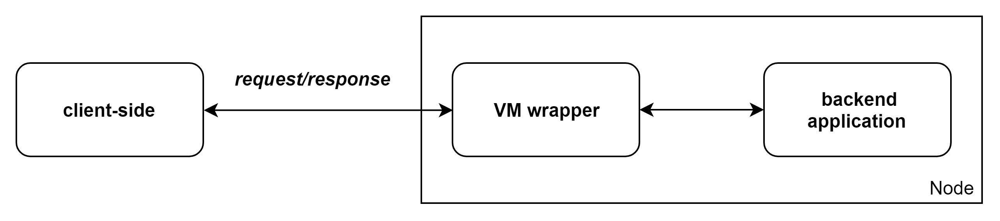

# Backend guide

The Fluence network is designed to run Webassembly (Wasm) applications (`app`) in decentralized trustless environments. Generally, the environment can be considered as several logical parts: a `client-side` (a frontend part used for sending requests to Wasm program), the `VM wrapper` (an intermediate layer that receives queries from client side and routes it to an `app`) and an `app` written on Wasm:

  

Each `app` should has some features to be able to run on Fluence. They are described in details in [backend application conventions](./app_conventions.md). To simplify `app` development we introduced a backend SDK (for more information about it please visit to [sdk overview](./sdk_overview.md) and [app debugging](./app_debugging.md)). If you are stack with some problem while `app` developing please refer to [best practices](./best_practices.md) and [examples](./examples.md) sections of this guide.
