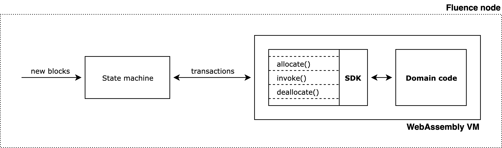

# Backend guide

Backend applications deployed to Fluence nodes are usually composed of two logical parts. The first part is the domain logic code produced by a developer. The second part is the Fluence SDK, which is responsible for accepting transactions, finding the right domain function to call, invoking this function and returning results back to the state machine.

<kbd>

</kbd>
  

It is not necessary for a developer to use Fluence SDK – it merely exists to make development more convenient. However, there are certain rules which the code running within WebAssembly VM is expected to follow, so if you want to build unpadded applications or implement your own SDK please consult the [following document](./conventions.md).

If you would like to learn how to build backend applications using the Fluence SDK, please visit [SDK overview](./sdk_overview.md), [debugging info](./debugging.md), and [key examples](./examples.md) sections.
