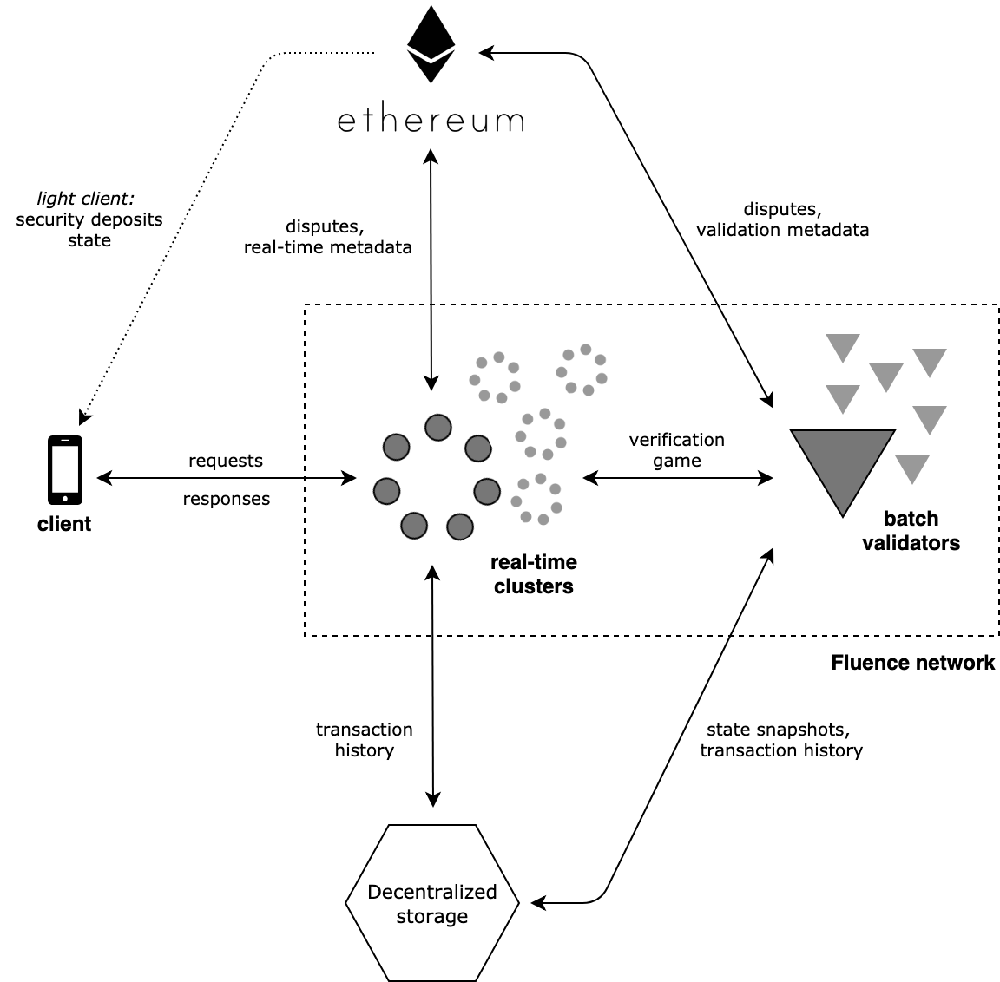

# Overview

The Fluence network consists of nodes performing computations in response to transactions sent by external clients. Algorithms specifying those computations are expressed in the WebAssembly bytecode; consequently, every node willing to participate in the network has to run a WebAssembly virtual machine.

Independent developers are expected to implement a backend package handling client transactions in a high-level language such as C/C++, Rust, or TypeScript, compile it into one or more WebAssembly modules, and then deploy those modules to the Fluence network. The network then takes care of spinning up the nodes that run the deployed backend package, interacting with clients, and making sure that client transactions are processed correctly.

## Architecture

Two major layers exist in the Fluence network: the real-time processing layer and the batch validation layer. The former is responsible for direct interaction with clients; the latter, for computation verification. In other words, real-time processing is the speed layer and batch validation is the security layer. The network also relies on Ethereum (as a secure metadata storage and dispute resolution layer) and Swarm (as a data availability layer) 

<kbd>

</kbd>
   

## Components
### Real-time processing layer
 
The real-time processing layer consists of multiple real-time clusters, which are stateful and keep locally the state required to serve client requests. Each cluster is formed by a few real-time worker nodes that are responsible for running particular backend packages and storing related state data. Workers in real-time clusters use Tendermint to reach BFT consensus and an interim metadata storage (built on top of a DHT such as Kademlia) to temporarily store consensus metadata before it is compacted and uploaded to the Ethereum blockchain.

<kbd>

</kbd>
   

To deploy a backend package to the Fluence network, the developer first has to allocate a cluster to run the package. Once the package is deployed, those functions that are exposed as external can be invoked by client transactions. If the package is no longer needed, the developer is able to terminate the cluster.

Developers possess significant control over real-time clusters: they are able to specify the desired cluster size and how much memory each node in the cluster should allocate to store the state. If one of the workers in the cluster is struggling, the developer who has allocated the cluster can replace this worker with a more performant one.

Real-time clusters are able to promptly respond to client requests, but those responses carry only moderate security guarantees when a significant fraction of network nodes are malicious. Because real-time clusters are formed by just a few worker nodes, they can tolerate only few malicious nodes, which leaves a non-trivial chance that a real-time cluster might be completely dominated by attackers. Therefore, an additional level of verification is required for computations performed by real-time clusters.

### Batch validation layer

To keep real-time clusters in check, the batch validation layer separately verifies all performed computations. This layer is composed of independent batch validators, which are stateless and have to download the required data before performing verification. In order to support this, every real-time cluster is required to upload the history of received transactions and performed state transitions to Swarm. Because Tendermint organizes transactions into blocks that each carry the hash of the state obtained after the previous block execution, real-time clusters upload transactions to Swarm in blocks as well.

Later on, batch validators replay fragments of transaction history, which are composed of one or more blocks, and challenge state transitions that they have deemed incorrect through the dispute resolution layer. If one of the state transitions is not correct, it takes only a single honest validator to challenge this and penalize the real-time cluster that performed the transition.

<kbd>

</kbd>
   

Developers do not have any control over batch validators beyond deciding how much budget is carved out for batch validation – i.e., how many batch validations should happen for the fragment of transaction history once it is uploaded to Swarm. Furthermore, the batch validator that verifies any specific history fragment is chosen randomly out of all batch validators in the network in order to prevent possible cartels.

Batch validators compact the transaction history and reduce Swarm space usage by uploading intermediate state snapshots to Swarm. Once a transaction history fragment has been verified a sufficient number of times, it is dropped, leaving only the corresponding snapshot.

<kbd>

</kbd>
   

   
   
### Dispute resolution layer
 
We have already mentioned that batch validators are able to dispute state transitions. This ability is not exclusive to batch validators: a real-time worker can submit a dispute if it disagrees with another real-time worker on how the state should be updated. However, such disputes normally arise only between workers that belong to the same cluster – other real-time workers simply do not carry the required state.

No matter which node has submitted the dispute, it is resolved with the aid of an external authority. The Fluence network uses a specially developed Ethereum smart contract named Arbiter as this authority. Because Ethereum is computationally bounded and thus unable to repeat the entire computation to verify state transitions, a verification game mechanism is used to find the first WebAssembly instruction that produced the diverging states. Only this instruction with the relevant portion of the state is then submitted to the Arbiter contract, which then makes its final decision as to which node performed the incorrect state transition.

Every node in the network is required to put down a significant security deposit before performing computations. If it is found that a node has behaved incorrectly, its deposit is slashed. Assuming that potential adversaries are financially restricted, this reduces the number of cases where a client might receive an incorrect response.
   
### Data availability layer 

The Swarm receipts mechanism is used to make sure that the fragments of transaction history uploaded by the real-time clusters do not disappear before the batch validators replay and verify them. The Swarm receipt is a confirmation from the Swarm node that it is responsible for the specific uploaded data. If the Swarm node is not able to return the data when requested, its deposit is slashed, which prevents Swarm from losing potentially incriminating data.

### Secure metadata storage 

Deposits placed by Fluence network nodes, Swarm receipts issued for transaction history fragments, and metadata entries related to the batch validation and real- time cluster compositions are stored in the Ethereum blockchain. For the sake of simplicity in this paper, we will assume that the Arbiter contract holds this data in addition to its dispute resolution responsibilities.