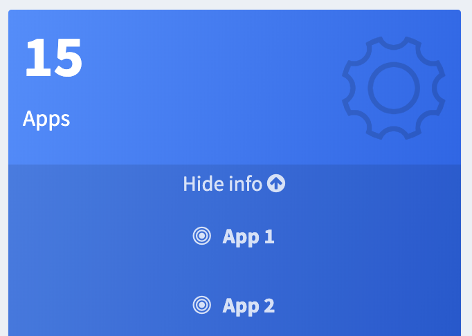
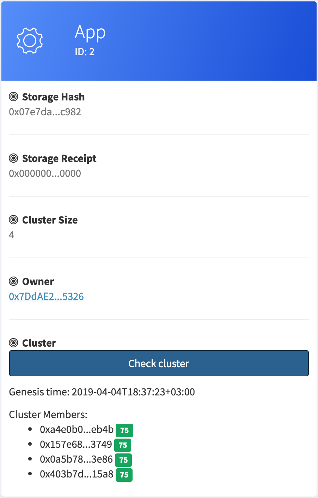

# Publishing the backend app

In the Fluence network, applications are deployed by uploading WebAssembly code to IPFS, and publishing hashes of the uploaded code to the Fluence smart contract.

It is also possible to specify the desired cluster size, which sets the required number of real-time workers in the cluster hosting the application. Note that the application might wait in the queue until there are enough free workers to form a cluster of the desired size.

## Connecting to IPFS and Ethereum Rinkeby nodes

To make sure we're on the same page:

- IPFS is a decentralized file storage
- Ethereum Rinkeby is one of Ethereum testnets, which works with toy money
- Fluence smart contract is what rules the Fluence network

To upload the application code to IPFS, you need to have access to one of IPFS nodes. The same with Ethereum: you need access to any Ethereum node running Rinkeby testnet.

For your convenience and to make this guide simpler, we use Ethereum and IPFS nodes set up by Fluence Labs, but you can use any other nodes if you wish.

**WARNING! This is not a secure way to connect to Ethereum or IPFS.**  
It should not be used in production or in a security-sensitive context.

## Registering an Ethereum Rinkeby account

### Via myetherwallet.com

Go to [MyEtherWallet.com](https://vintage.myetherwallet.com/), select any Rinkeby in the upper right dropdown, enter any password, and download the Keystore file. You will find your account address in the last part of the Keystore file name, for example: 

<pre>
UTC--2019-03-03T14-48-59.325Z--<b>e1f9c157b45838ca83cb51b7bdcc6c7a3e56650f</b>
</pre>

### Top up your account with funds

There are two main Rinkeby faucets. 

[This one](https://faucet.rinkeby.io/) gives you up to 18 Ether, but it requires you to post an Ethereum address to a social network. 

[Another one](http://rinkeby-faucet.com/) gives you ETH right away, but just 0.001 Ether, which isn't enough for the publishing, so you may try to top up several times. 

## Installing the Fluence CLI

It is hard to send publication transactions manually, so we provide the Fluence CLI.  
You can download the CLI from the [releases](https://github.com/fluencelabs/fluence/releases/) page, or fetch it in the terminal:

**Linux**
```bash
curl -L https://github.com/fluencelabs/fluence/releases/download/v0.1.6/fluence-cli-0.1.6-linux-x64 -o fluence
```

**macOS**
```bash
curl -L https://github.com/fluencelabs/fluence/releases/download/v0.1.6/fluence-cli-0.1.6-mac-x64 -o fluence

```

Don't forget to add permissions to run it:
```bash
chmod +x ./fluence

# check that the CLI is working
./fluence --version
Fluence CLI 0.1.6
```

## Publishing the application with the Fluence CLI
As we have already mentioned, you need to have access to the Ethereum Rinkeby and IPFS networks. You can either use Ethereum and IPFS nodes set up by Fluence Labs, or specify other nodes by providing their URIs using `--eth_url` and `--storage_url` options.

You also need a Rinkeby account with some money on it (you can [get Ethers from faucet](https://faucet.rinkeby.io/)) and its private key, which can either be a hex string or a [Keystore file](../cli.md#keystore-json-file).

To interact with the Fluence CLI, we will set it up first:

```bash
./fluence setup
```
This command will ask you to enter the Fluence contract address, IPFS and Ethereum node addresses, and, finally, your account credentials. It will create the config file which will be used by the CLI tool in the future.

By default, IPFS and Ethereum nodes controlled by Fluence Labs will be used. Note that you need to provide either the secret key **or** the Keystore file path + password to be able to send transactions to Ethereum.

Having all that, now you are ready to publish your application:

```bash
./fluence publish \
            --code_path        ~/hello-world/target/wasm32-unknown-unknown/release/hello_world.wasm \
            --gas_price        10 \
            --cluster_size     4 \
            --wait_syncing \
            --wait
```

Once the command completes, you should see an output similar to the following:
```bash
[1/3]   Application code uploaded. ---> [00:00:00]
IPFS hash: 0xf5c604478031e9a658551220da3af1f086965b257e7375bbb005e0458c805874
[2/3]   Transaction publishing app was sent. ---> [00:00:03]
  tx hash: 0x5552ee8f136bce0b020950676d84af00e4016490b8ee8b1c51780546ad6016b7
[3/3]   Transaction was included. ---> [00:02:38]
App deployed.
  app id: 2
  tx hash: 0x5552ee8f136bce0b020950676d84af00e4016490b8ee8b1c51780546ad6016b7
```


## Verifying the application status
To check the state of your application – for example, which nodes it was deployed to, go to the [dashboard](http://dash.fluence.network), and find your app in the apps list:

<div style="text-align:center">
<kbd>

</kbd>
<br><br><br>
</div>

Click on your app, you will see it's status:
<div style="text-align:center">
<kbd>

</kbd>
<br><br><br>
</div>

Press on the `Check cluster` button, and after a while green boxes with a number on it will appear. That is the height of your app's Tendermint blockchain. 

For a healthy cluster, it should be bigger than 1, that means that application was started successfully, and ready to work! 
