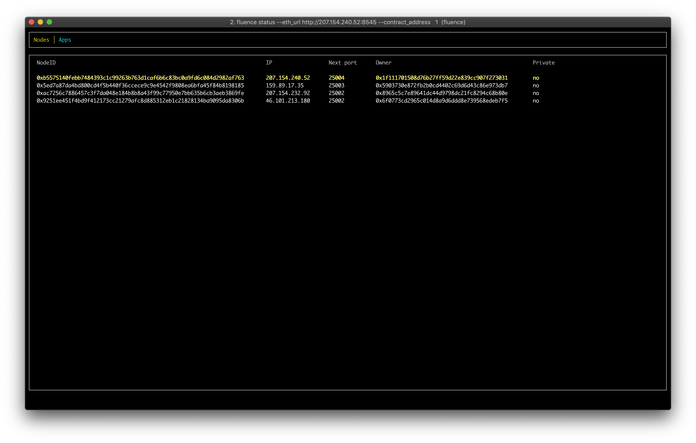

# Publishing your app
## Connect to Swarm and Ethereum Rinkeby
To publish a backend app to Fluence network, you need to upload it to Swarm, and then send its location in Swarm to a Fluence smart contract on Ethereum Rinkeby testnet. 

To make sure we're on the same page:
- Swarm is a decentralized file storage. 
- Ethereum Rinkeby testnet is one of the many Ethereum networks, but there's no real money in there, so it's safe and can be used for trying out something new.
- Fluence smart contract is what rules the Fluence network and allows users to use it.

To upload your code to Swarm, you need to have access to one of its nodes. The same with Ethereum, you will need a connection to any Ethereum node on Rinkeby testnet.

**We will use existing Ethereum & Swarm nodes, but if you wish, you can [use your own nodes](miner.md) or any other.**

## Registering an Ethereum Rinkeby account
### Via myetherwallet.com
Go to https://vintage.myetherwallet.com/, then select Rinkeby in the upper right, enter any password, and download the Keystore file.

### Top up account with funds
Follow instructions for [Rinkeby faucet](https://faucet.rinkeby.io/)

## Installing Fluence CLI
You can download Fluence CLI from here https://github.com/fluencelabs/fluence/releases/tag/cli-0.1.2

Or in terminal:

**Linux**
```bash
~ $ curl -L https://github.com/fluencelabs/fluence/releases/download/cli-0.1.2/fluence-cli-0.1.2-linux-x64 -o fluence
```

**macOS**
```bash
~ $ curl -L https://github.com/fluencelabs/fluence/releases/download/cli-0.1.2/fluence-cli-0.1.2-mac-x64 -o fluence
```

And finally don't forget to add permission to execute it:
```bash
~ $ chmod +x ./fluence

# check CLI is working
~ $ ./fluence --version
Fluence CLI 0.1.2
```

If you see CLI version, proceed to the next step.

## Publishing via Fluence CLI
As was mentioned before, you will need a connection to Ethereum Rinkeby network, and a connection to Swarm network. 

For your convenience, and to make this guide simple, we use addresses of existing Ethereum Rinkeby and Swarm nodes running in a cloud on Fluence nodes. **However, this is a centralized way to connect to Ethereum Rinkeby and Swarm networks, and shouldn't be used in production or in a security-sensitive context.** You may use **any** Rinkeby and Swarm nodes by providing their URIs within `--eth_url` and `--swarm_url` options (see below).

Also you will need a Rinkeby account with some money on it (you can [get money from faucet](https://faucet.rinkeby.io/)) and it's private key. Private key can be either a hex string or a [JSON keystore file](../cli/README.md#keystore-json-file).

Having all that, you're now ready to publish your app. Examples below will specify a cluster size of 4 nodes for your app. Adjust it to your needs.

If you have your private key **in hex**, run the following in your terminal, replacing `<>` with actual values:
```bash
~ $ ./fluence publish \
            --eth_url          http://207.154.232.92:8545 \
            --swarm_url        http://207.154.232.92:8500 \
            --code_path        ~/hello-world/target/wasm32-unknown-unknown/release/hello_world.wasm \
            --gas_price        10 \
            --account          <your ethereum address> \
            --secret_key       <your ethereum private key> \
            --cluster_size     4 \
            --wait_syncing \
            --wait
```

If you have a JSON **keystore file**, run the following in your terminal, replacing `<>` with actual values:

```bash
~ $ ./fluence publish \
            --eth_url          http://207.154.232.92:8545 \
            --swarm_url        http://207.154.232.92:8500 \
            --code_path        ~/hello-world/target/wasm32-unknown-unknown/release/hello_world.wasm \
            --gas_price        10 \
            --account          <your ethereum address> \
            --keystore         <path to keystore> \
            --password         <password for keystore> \
            --cluster_size     4 \
            --wait_syncing \
            --wait
```
There is more info on using keystore files with Fluence CLI in it's [README](../cli/README.md#keystore-json-file).


After running the command, you will see an output similar to the following:
```bash
[1/3]   Application code uploaded. ---> [00:00:00]
swarm hash: 0xf5c604478031e9a658551220da3af1f086965b257e7375bbb005e0458c805874
[2/3]   Transaction publishing app was sent. ---> [00:00:03]
  tx hash: 0x5552ee8f136bce0b020950676d84af00e4016490b8ee8b1c51780546ad6016b7
[3/3]   Transaction was included. ---> [00:02:38]
App deployed.
  app id: 2
  tx hash: 0x5552ee8f136bce0b020950676d84af00e4016490b8ee8b1c51780546ad6016b7
```


## Check app status
To see how smart contract sees your app, and what nodes it was deployed onto, you can use `status` like this:
```bash
~ $ ./fluence status \
            --eth_url          http://207.154.232.92:8545 \
            --app_id           <your app id here>
```

The output will be in JSON, and look similar to the following:
```json
{
  "apps": [
    {
      "app_id": "<your app id here>",
      "storage_hash": "<swarm hash>",
      "storage_receipt": "0x0000000000000000000000000000000000000000000000000000000000000000",
      "cluster_size": 4,
      "owner": "<your ethereum address>",
      "pin_to_nodes": [],
      "cluster": {
        "genesis_time": 1549353504,
        "node_ids": [
          "0x5ed7aaada4bd800cd4f5b440f36ccece9c9e4542f9808ea6bfa45f84b8198185",
          "0xb557bb40febb7484393c1c99263b763d1caf6b6c83bc0a9fd6c084d2982af763",
          "0xac72ccc7886457c3f7da048e184b8b8a43f99c77950e7bb635b6cb3aeb3869fe",
          "0x9251dd451f4bd9f412173cc21279afc8d885312eb1c21828134ba9095da8306b",
        ],
        "ports": [
          25001
        ]
      }
    }
  ],
  "nodes": [
    {
      "validator_key": "0x5ed7a87da4bd800cd4f5b440f36ccece9c9e4542f9808ea6bfa45f84b8198185",
      "tendermint_p2p_id": "0x6c03a3fe792314f100ac8088a161f70bd7d257b1",
      "ip_addr": "43.32.21.10",
      "next_port": 25003,
      "last_port": 25099,
      "owner": "0x5902720e872fb2b0cd4402c69d6d43c86e973db7",
      "is_private": false,
      "app_ids": [
        1,
        2,
        6
      ]
    },
    "<3 more nodes here>"
  ]
}
```

You can also use interactive mode instead of default by supplying `--interactive` flag:
```bash
./fluence status \
            --eth_url          http://207.154.232.92:8545 \
            --app_id           <your app id here> \
            --interactive
```

<div style="text-align:center">

<br>
</div>

You can press `q` to exit it.

Your backend now is successfully deployed! You can proceed to access your code from a web browser.
