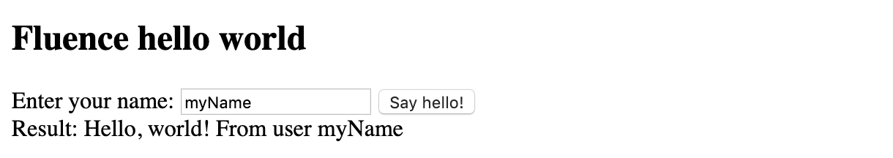

# Developing the web app

For this part, you need installed `npm`. Please refer to [npm docs](https://www.npmjs.com/get-npm) for installation instructions.

## Preparing web application

Let's clone a simple web app template:
```bash
~ $ git clone https://github.com/fluencelabs/frontend-template
~ $ cd frontend-template
~/frontend-template $ 
```

Inside you should find:
- `package.json` which adds required dependencies
- `webpack.config.js` which is needed for the webpack to work
- `index.js` which demonstrates how to interact with the real-time cluster

The template web application uses the Fluence frontend SDK. This SDK allows to locate the real-time cluster with the help of the Fluence smart contract, and then send transactions to this cluster.

Let's take a look at `index.js`:
```javascript

// the address of the Fluence smart contract on Ethereum
let contractAddress = "0xf008c29bb1fabd1eb1ea73b2410f523a5c213f19";

// the address of the Ethereum node
// MetaMask is used to send transactions if this address is set to `undefined`, 
let ethUrl = "http://207.154.240.52:8545/";

// the backend appId as seen in the Fluence smart contract
let appId = "6";

...

// create a session between the frontend client and the backend application
// the session is used to send transactions to the real-time cluster
fluence.connect(contractAddress, appId, ethUrl).then((s) => {
  console.log("Session created");
  window.session = s;
  helloBtn.disabled = false;
});

...

// set a callback on the button click
helloBtn.addEventListener("click", send)

// send a transaction with the name to the real-time cluster and display the response
function send() {
  const username = usernameInput.value.trim();
  let result = session.invoke(username);
  getResultString(result).then(function (str) {
    greetingLbl.innerHTML = str;
  });
}
```

## Running the web application

Make sure that you have changed the `appId` variable to the identifier of the deployed backend! 

To install dependencies, and compile and run your web application, run:

```bash
~/frontend-template $ npm install
~/frontend-template $ npm run start
> frontend-template@1.0.0 start /private/tmp/frontend-template
> webpack-dev-server

ℹ ｢wds｣: Project is running at http://localhost:8080/
...
```

Now you can open [http://localhost:8080/](http://localhost:8080/) in your browser. You should see an input text element and a disabled button, which should become enabled once the session with the backend is initialized.

<div style="text-align:center">
<kbd>

</kbd>
<br><br>
</div>

You can also open the developer console, and check out the Fluence SDK logs:
```
...
Connecting web3 to http://207.154.232.92:8545
...
Session created
```

You can also interact with the backend application from the developer console:

```javascript
let result = session.invoke("MyName");
<undefined>
logResultAsString(result);
<undefined>
Hello, world! -- MyName
```
