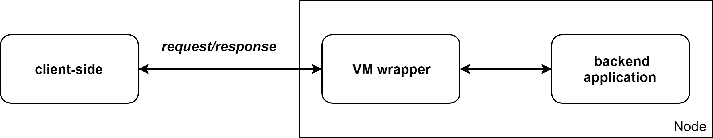

# Introduction

This book describes the `Fluence backend SDK` and its possible usages for development of backend application for the Fluence network.

The Fluence network is designed to run Webassembly (Wasm) program in decentralized trustless environments. Generally it can be considered as several logical parts: a `client-side` (a frontend part used for sending requests to Wasm program), the `VM wrapper` (an intermediate layer that receives queries from client side and routes it to a Wasm program) and a `backend app` written on Wasm:

  

But an arbitrary Wasm code can't be run on Fluence - for example, it can use some imports of host-based functions that environment isn't provided for security reasons. And also each Wasm program has to follow some conventions to be able to interact with `VM wrapper`. These are described in details in [Backend application conventions](app_convention.md) section of this book.
