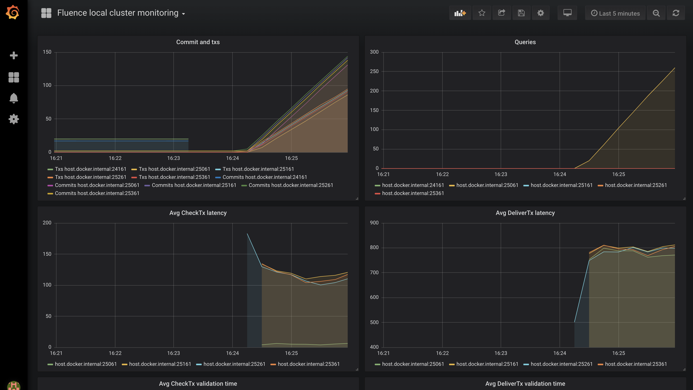

## Monitoring local Fluence clusters via Prometheus and Grafana

### Prerequisites
* `docker` and `docker-compose`

### Launching monitoring tools

Run from `tools/monitoring` directory:

```
docker-compose up
```

It would run `prometheus` on [localhost:9090](http://localhost:9090) and 
`grafana` on [localhost:3000](http://localhost:3000).

Use `admin` user with `foobar` password to login in Grafana. 
After a successful login, the main Grafana page might look like this:


Clich `Fluence local cluster monitoring` dashboard. It would look similar to this:




### Stopping monitoring tools

```
docker-compose down
```
